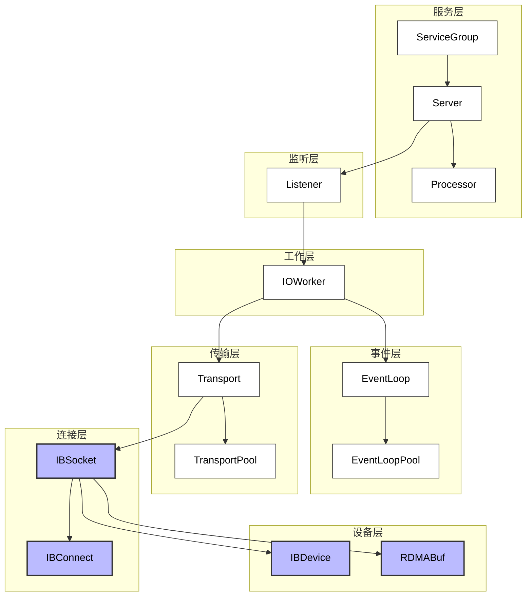
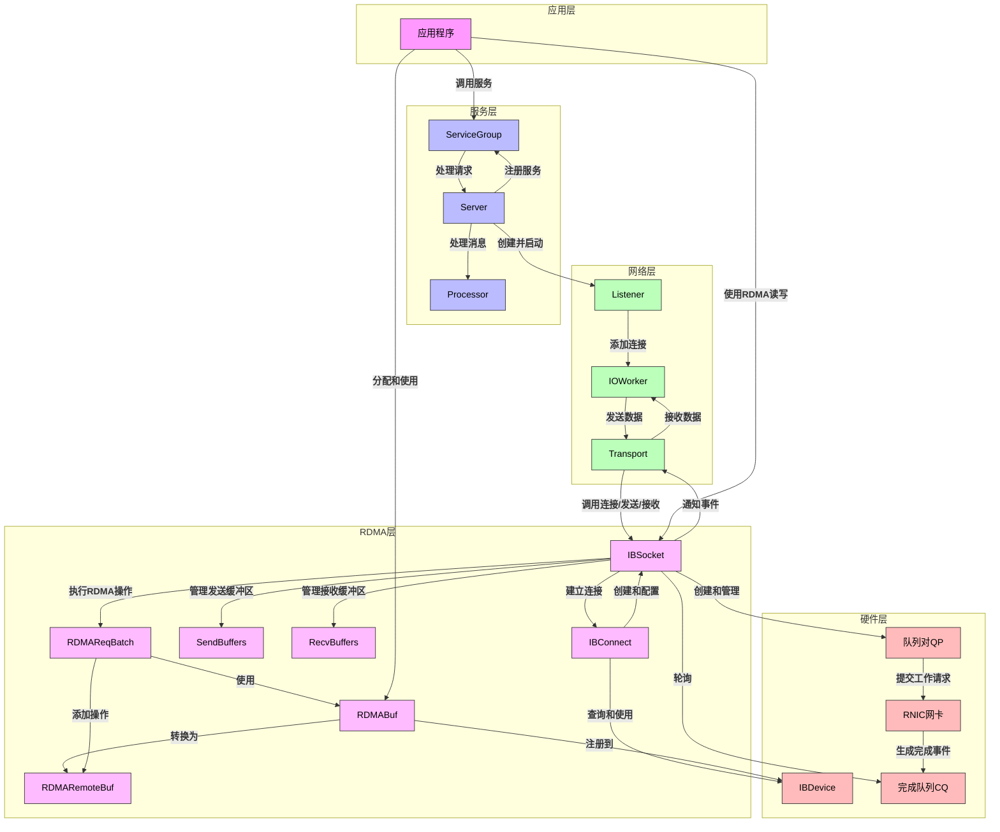
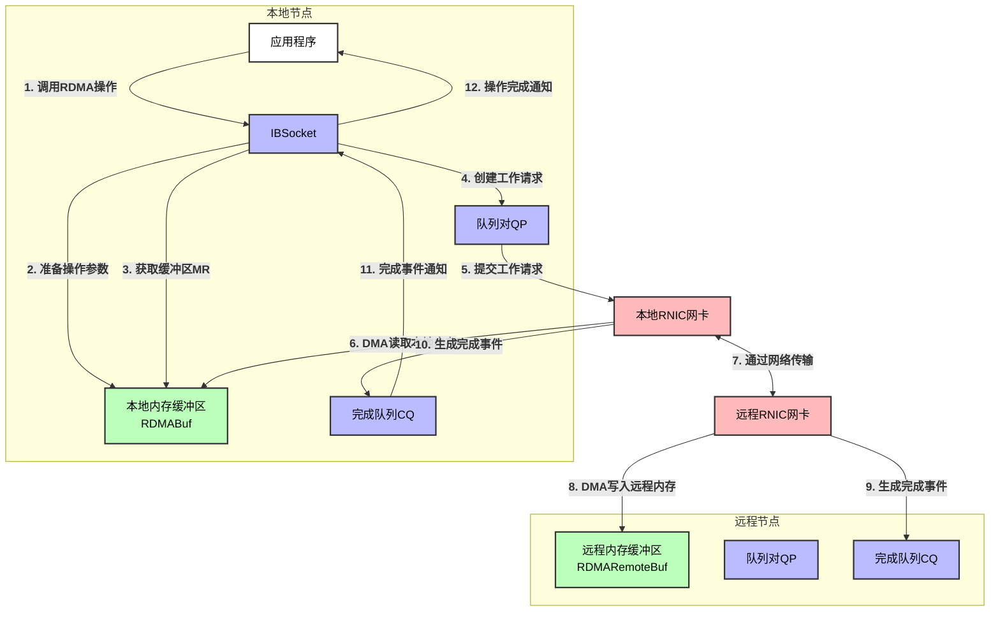
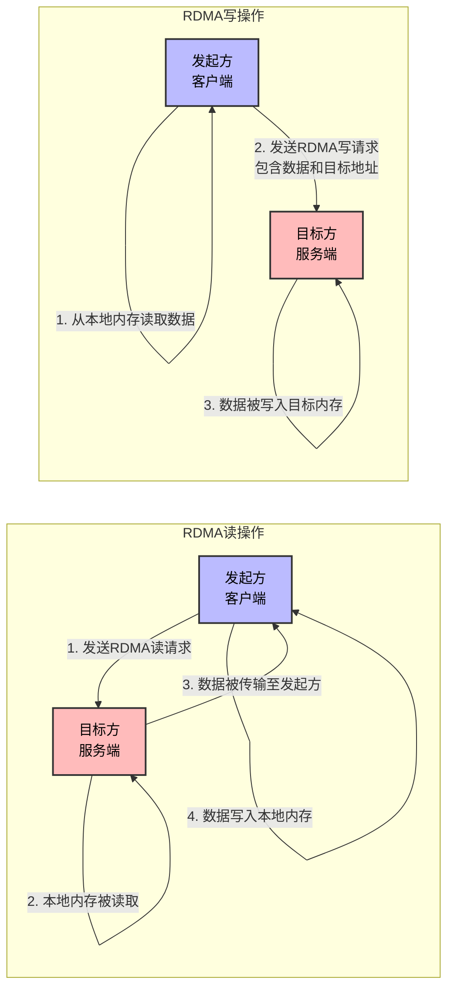

# 3FS网络通信模块实现原理

## 1. 概述

3FS网络通信模块是一个高性能、低延迟的网络通信框架，支持TCP和RDMA两种通信方式。该模块抽象出了一系列核心组件，包括Listener、IOWorker、EventLoop、Transport、IBSocket等，它们共同构成了一个强大的网络子系统，为3FS中的各个服务提供高效的通信支持。

本文档主要分析3FS网络通信模块的实现原理，包括各个核心组件的设计、工作流程以及它们之间的协作关系，特别关注RDMA通信链路的实现。

## 2. 系统架构

3FS网络通信模块采用分层设计，主要包括以下几个层次：

1. **设备层**：管理物理网络设备，包括IBDevice等
2. **连接层**：管理网络连接，包括IBSocket、IBConnect等
3. **传输层**：封装数据传输，包括Transport、TransportPool等
4. **事件层**：处理网络事件，包括EventLoop、EventLoopPool等
5. **工作层**：处理IO任务，包括IOWorker等
6. **监听层**：监听连接请求，包括Listener等
7. **服务层**：提供RPC服务，包括ServiceGroup、Server等

这些层次之间通过明确的接口进行交互，形成了一个完整的网络通信栈。

### 2.1 系统架构图



## 3. 核心组件

### 3.1 Listener

Listener是网络通信框架中负责监听和接受连接的核心组件，它支持多种网络类型，包括TCP、UNIX域套接字和RDMA。

#### 3.1.1 主要功能

1. 在指定的网络接口和端口上监听连接请求
2. 接受TCP和RDMA连接
3. 将接受的连接交给IOWorker处理
4. 支持多网卡监听
5. 支持端口重用

#### 3.1.2 工作流程

1. **初始化和设置**：
   - 加载网络接口列表
   - 根据过滤条件和网络类型选择合适的网络接口
   - 为每个地址创建服务器套接字

2. **启动监听**：
   - 对于RDMA网络类型，创建IBConnectService并添加到ServiceGroup
   - 为每个服务器套接字启动监听协程

3. **接受连接**：
   - 对于TCP连接，调用`acceptTCP`方法处理
   - 对于RDMA连接，调用`acceptRDMA`方法处理
   - 将接受的连接添加到IOWorker中

4. **RDMA连接检查**：
   - 等待一段时间（由`rdma_accept_timeout`配置）
   - 检查IBSocket是否完成连接
   - 如果连接未完成，则使Transport无效

### 3.2 IOWorker

IOWorker是网络通信框架中负责处理所有IO任务的核心组件，它管理TCP和RDMA连接，处理数据的发送和接收，并负责连接的建立和释放。

#### 3.2.1 主要功能

1. 管理网络连接（TCP和RDMA）
2. 处理异步消息发送和接收
3. 协调事件循环和任务调度
4. 提供连接池和资源管理

#### 3.2.2 工作流程

1. **启动和停止**：
   - 启动事件循环池
   - 等待所有任务完成
   - 断开所有连接

2. **添加连接**：
   - 创建Transport对象
   - 将Transport添加到事件循环池
   - 将Transport添加到传输池

3. **发送消息**：
   - 获取目标地址的Transport
   - 发送消息列表
   - 如果发送失败，移除Transport并重试

4. **连接建立**：
   - 根据Transport类型（RDMA或TCP）进行连接
   - 对于RDMA连接，使用并发限制器限制并发连接数
   - 将Transport添加到事件循环池

5. **读写任务**：
   - 根据Transport类型和配置决定在事件线程还是CPU执行器中执行读写操作
   - 调用Transport的doRead或doWrite方法

### 3.3 EventLoop

EventLoop是网络通信框架中负责处理网络事件的核心组件，它基于epoll机制实现，能够高效地监控大量连接的IO事件。

#### 3.3.1 主要功能

1. 监控文件描述符的IO事件
2. 分发事件到相应的处理函数
3. 支持添加和移除监控的文件描述符
4. 支持定时器事件

#### 3.3.2 工作流程

1. **初始化**：
   - 创建epoll实例
   - 初始化事件数组

2. **事件循环**：
   - 调用epoll_wait等待事件
   - 处理定时器事件
   - 处理IO事件

3. **添加监控**：
   - 将文件描述符添加到epoll实例
   - 设置事件类型和回调函数

4. **移除监控**：
   - 从epoll实例中移除文件描述符
   - 清理相关资源

### 3.4 Transport

Transport是网络通信框架中负责数据传输的核心组件，它封装了TCP和RDMA两种传输方式，提供了统一的接口。

#### 3.4.1 主要功能

1. 封装TCP和RDMA传输
2. 提供统一的发送和接收接口
3. 管理连接状态
4. 处理传输错误

#### 3.4.2 工作流程

1. **创建Transport**：
   - 根据Socket类型创建相应的Transport
   - 初始化Transport状态

2. **连接建立**：
   - 调用Socket的connect方法
   - 设置连接状态

3. **数据发送**：
   - 将数据添加到发送队列
   - 触发写事件

4. **数据接收**：
   - 从Socket读取数据
   - 解析消息头和消息体
   - 将完整的消息交给Processor处理

5. **错误处理**：
   - 检测传输错误
   - 关闭连接并清理资源

### 3.5 IBSocket

IBSocket是网络通信框架中负责RDMA通信的核心组件，它封装了IB通信的基本功能，提供了类似于TCP Socket的接口，同时支持RDMA操作。

#### 3.5.1 主要功能

1. 连接管理：建立和接受IB连接
2. 数据传输：发送和接收数据
3. RDMA操作：支持RDMA读写操作
4. 连接状态管理：监控连接状态，处理错误情况
5. 优雅关闭：支持连接的优雅关闭

#### 3.5.2 内部结构

IBSocket内部包含多个重要的组件：

1. **状态管理**：使用状态机管理连接的生命周期
2. **缓冲区管理**：使用SendBuffers和RecvBuffers管理数据传输
3. **RDMA操作**：支持RDMA读写操作和批量RDMA操作
4. **完成队列处理**：处理IB操作的完成事件

#### 3.5.3 工作流程

1. **连接建立**：
   - 客户端调用`connect`方法发起连接
   - 服务端调用`accept`方法接受连接
   - 双方交换连接信息，设置QP状态

2. **数据传输**：
   - 常规发送/接收：通过SendBuffers和RecvBuffers进行
   - RDMA操作：直接访问远程内存，无需远程CPU参与

3. **连接关闭**：
   - 发送关闭消息给对方
   - 等待对方确认
   - 修改QP状态为ERROR
   - 释放资源

### 3.6 IBConnect

IBConnect是网络通信框架中负责建立InfiniBand连接的核心组件，它提供了一套完整的机制来实现IB设备的发现、匹配和连接建立。

#### 3.6.1 主要功能

1. 设备发现：查询远程节点的IB设备信息
2. 设备匹配：根据链路层类型、端口状态等条件匹配设备
3. 连接建立：创建和初始化队列对(QP)，设置QP状态
4. 连接参数交换：交换连接信息，包括QP号、LID等

#### 3.6.2 工作流程

1. **设备查询和匹配**：
   - 查询远程节点的设备信息
   - 根据链路层类型、端口状态等条件匹配设备

2. **客户端连接流程**：
   - 查询远程节点的设备信息
   - 选择匹配的设备
   - 创建和初始化队列对(QP)
   - 发送连接请求
   - 接收连接响应
   - 设置QP状态为RTR和RTS
   - 发送空消息通知对方连接已建立

3. **服务端接受连接流程**：
   - 检查本地端口
   - 创建和初始化队列对(QP)
   - 设置对等信息
   - 设置QP状态为RTR
   - 等待客户端发送的空消息

### 3.7 RDMABuf

RDMABuf是网络通信框架中负责管理RDMA内存缓冲区的核心组件，它提供了一套完整的机制来实现RDMA内存的分配、注册、管理和回收。

#### 3.7.1 主要功能

1. 内存分配和注册：分配内存并注册到IB设备
2. 内存管理：提供缓冲区操作和类型转换
3. 内存池化：通过RDMABufPool实现内存复用
4. 序列化支持：支持远程缓冲区的序列化和反序列化

#### 3.7.2 工作流程

1. **内存分配和注册**：
   - 分配页对齐的内存
   - 将内存注册到所有IB设备
   - 保存每个设备的内存注册句柄

2. **内存池化管理**：
   - 创建固定大小的缓冲区池
   - 从池中分配缓冲区
   - 回收缓冲区到池中

3. **缓冲区操作**：
   - 提供范围操作（advance、subtract、subrange等）
   - 支持类型转换（span、ByteRange等）
   - 支持RDMA操作（getMR、toRemoteBuf等）

## 4. 组件协作

### 4.1 连接建立流程

3FS网络通信模块的连接建立流程涉及多个组件的协作：

1. **Listener监听连接请求**：
   - 在指定的网络接口和端口上监听连接请求
   - 对于RDMA网络类型，创建IBConnectService并添加到ServiceGroup

2. **客户端发起连接**：
   - 对于TCP连接，创建TCP Socket并连接到服务器
   - 对于RDMA连接，创建IBSocket并调用connect方法

3. **服务端接受连接**：
   - 对于TCP连接，Listener接受连接并创建Transport
   - 对于RDMA连接，IBConnectService接受连接并创建IBSocket

4. **连接添加到IOWorker**：
   - Listener将接受的连接添加到IOWorker
   - IOWorker创建Transport并添加到事件循环池和传输池

5. **连接就绪**：
   - 对于TCP连接，连接立即就绪
   - 对于RDMA连接，需要完成QP状态的设置

### 4.2 数据传输流程

3FS网络通信模块的数据传输流程也涉及多个组件的协作：

1. **应用层发送数据**：
   - 应用层调用IOWorker的sendAsync方法发送数据
   - IOWorker获取目标地址的Transport
   - Transport调用send方法发送数据

2. **Transport发送数据**：
   - 对于TCP Transport，将数据写入TCP Socket
   - 对于RDMA Transport，将数据交给IBSocket处理

3. **IBSocket发送数据**：
   - 对于常规发送，从SendBuffers获取缓冲区，复制数据，调用postSend
   - 对于RDMA操作，准备本地和远程缓冲区信息，调用rdmaPost

4. **数据接收处理**：
   - EventLoop检测到读事件，通知Transport
   - Transport调用doRead方法读取数据
   - 对于TCP Transport，从TCP Socket读取数据
   - 对于RDMA Transport，从IBSocket读取数据
   - IBSocket从RecvBuffers获取接收到的数据
   - Transport解析消息并交给Processor处理

5. **RDMA数据传输**：
   - 应用层调用IBSocket的rdmaRead或rdmaWrite方法
   - IBSocket准备RDMA操作参数，提交操作
   - 完成队列产生完成事件，IBSocket处理完成事件
   - 应用层获取操作结果

### 4.3 事件处理流程

3FS网络通信模块的事件处理流程主要由EventLoop和IOWorker协作完成：

1. **EventLoop监控事件**：
   - EventLoop使用epoll监控文件描述符的IO事件
   - 当事件发生时，EventLoop调用相应的回调函数

2. **Transport处理事件**：
   - 对于读事件，Transport调用IOWorker的startReadTask方法
   - 对于写事件，Transport调用IOWorker的startWriteTask方法

3. **IOWorker调度任务**：
   - IOWorker根据配置决定在事件线程还是CPU执行器中执行任务
   - 如果在事件线程中执行，直接调用Transport的doRead或doWrite方法
   - 如果在CPU执行器中执行，将任务添加到CPU执行器

4. **Transport执行IO操作**：
   - Transport的doRead方法从Socket读取数据
   - Transport的doWrite方法向Socket写入数据

5. **IBSocket处理完成事件**：
   - IBSocket轮询完成队列，获取完成事件
   - 对于接收完成事件，调用onRecved方法
   - 对于发送完成事件，更新SendBuffers状态

### 4.4 RDMA组件交互关系

在3FS系统的RDMA通信过程中，各个组件之间存在复杂的交互关系，下图展示了这些组件在RDMA通信中的协作方式：



这个组件交互图展示了在RDMA通信过程中，从应用层到硬件层的完整组件链路：

1. **应用层**：应用程序通过服务接口发起通信请求，或直接使用RDMA操作。
2. **服务层**：ServiceGroup、Server和Processor协作处理服务请求。
3. **网络层**：Listener接受连接请求，IOWorker管理连接，Transport封装传输细节。
4. **RDMA层**：IBSocket提供RDMA通信接口，IBConnect建立连接，RDMABuf系列组件管理内存。
5. **硬件层**：IBDevice、队列对(QP)和完成队列(CQ)与RNIC网卡交互，执行实际的RDMA操作。

RDMA通信的核心优势在于应用程序可以绕过大部分软件栈，直接控制RDMA操作，实现高性能、低延迟的数据传输。同时，3FS网络通信模块通过各个组件之间的紧密协作，将RDMA的技术特性转化为实际的性能优势。

## 5. RDMA通信链路

3FS网络通信模块的RDMA通信链路是其核心特性之一，它提供了高性能、低延迟的数据传输能力。

### 5.1 RDMA通信原理

RDMA（Remote Direct Memory Access）是一种允许计算机在不涉及操作系统或CPU的情况下，直接访问另一台计算机内存的技术。RDMA的主要特点包括：

1. **零拷贝**：数据直接从源内存传输到目标内存，无需中间拷贝
2. **内核旁路**：数据传输不经过操作系统内核，减少了上下文切换
3. **CPU卸载**：数据传输由网卡硬件完成，减轻了CPU负担
4. **低延迟**：由于避免了系统调用和内核处理，延迟大大降低
5. **高带宽**：可以充分利用网络带宽，实现高吞吐量

### 5.1.1 RDMA连接建立序列图

```mermaid
sequenceDiagram
    participant C as 客户端
    participant S as 服务端
    
    C->>S: 1. 发送连接请求(包含QP信息)
    S->>S: 2. 创建QP
    S->>C: 3. 返回QP信息
    C->>C: 4. 创建QP
    C->>S: 5. 发送Ready消息
    S->>C: 6. 确认Ready
    
    Note over C,S: 连接建立完成，可以开始数据传输
    
    style C fill:#f96,stroke:#333,stroke-width:2px,color:#fff
    style S fill:#69f,stroke:#333,stroke-width:2px,color:#fff
```

### 5.2 IBSocket的RDMA实现

IBSocket实现了两种RDMA操作：RDMA读和RDMA写。

### 5.2.1 RDMA数据传输流程图



#### 5.2.1 RDMA写操作

RDMA写操作允许本地节点将数据直接写入远程节点的内存，无需远程CPU参与。IBSocket提供了以下RDMA写接口：

```cpp
CoTryTask<void> rdmaWrite(const RDMARemoteBuf &remoteBuf, std::span<RDMABuf> localBufs);
CoTryTask<void> rdmaWrite(const RDMARemoteBuf &remoteBuf, const RDMABuf &localBuf);
RDMAReqBatch rdmaWriteBatch();
```

RDMA写操作的流程：
1. 准备本地缓冲区和远程缓冲区信息
2. 创建RDMA写工作请求
3. 提交工作请求到发送队列
4. 等待操作完成
5. 处理完成事件

#### 5.2.2 RDMA读操作

RDMA读操作允许本地节点直接读取远程节点的内存，无需远程CPU参与。IBSocket提供了以下RDMA读接口：

```cpp
CoTryTask<void> rdmaRead(const RDMARemoteBuf &remoteBuf, std::span<RDMABuf> localBufs);
CoTryTask<void> rdmaRead(const RDMARemoteBuf &remoteBuf, const RDMABuf &localBuf);
RDMAReqBatch rdmaReadBatch();
```

RDMA读操作的流程：
1. 准备本地缓冲区和远程缓冲区信息
2. 创建RDMA读工作请求
3. 提交工作请求到发送队列
4. 等待操作完成
5. 处理完成事件

#### 5.2.3 批量RDMA操作

为了提高性能，IBSocket支持批量RDMA操作，通过RDMAReqBatch类实现：

```cpp
class RDMAReqBatch {
public:
  RDMAReqBatch(IBSocket *socket, int opcode);
  void add(const RDMARemoteBuf &remoteBuf, const RDMABuf &localBuf);
  CoTryTask<void> post();
};
```

批量RDMA操作的优势：
1. 减少RDMA请求的提交次数
2. 减少完成事件的数量
3. 提高系统吞吐量

#### 5.2.4 RDMA读写操作对比



### 5.3 RDMABuf的内存管理

RDMABuf提供了高效的RDMA内存管理机制：

1. **内存分配**：使用页对齐的内存，提高DMA效率
2. **内存注册**：将内存注册到IB设备，支持RDMA操作
3. **内存池化**：通过RDMABufPool实现内存复用，减少内存分配和注册开销
4. **缓冲区操作**：提供丰富的缓冲区操作方法，支持分段处理和数据切片

### 5.4 IBConnect的连接建立

IBConnect负责建立RDMA连接，它通过TCP连接交换IB设备信息和连接参数，然后建立高性能的IB连接：

1. **设备发现**：查询远程节点的IB设备信息
2. **设备匹配**：根据链路层类型、端口状态等条件匹配设备
3. **连接建立**：创建和初始化队列对(QP)，设置QP状态
4. **连接参数交换**：交换连接信息，包括QP号、LID等

### 5.5 RDMA性能优化

3FS网络通信模块在RDMA实现上采用了多种性能优化策略：

1. **批量处理**：
   - 批量轮询完成队列
   - 批量提交RDMA操作
   - 批量确认接收缓冲区

2. **信号控制**：
   - 使用信号控制机制减少完成事件的数量
   - 只有每隔一定数量的操作才会产生完成事件

3. **内存管理**：
   - 预分配缓冲区
   - 缓冲区重用
   - 内存池化

4. **并发控制**：
   - 使用并发限制器限制并发连接数
   - 避免对同一目标进行过多的连接尝试

### 5.6 RDMA端到端通信流程

```mermaid
flowchart TD
    Start([开始]) --> ClientInit[客户端初始化<br>创建IBSocket]
    Start --> ServerInit[服务端初始化<br>创建IBConnectService<br>监听连接请求]
    
    ClientInit --> DeviceQuery[客户端发送设备查询请求]
    DeviceQuery --> ServerResponse[服务端返回设备信息]
    ServerResponse --> DeviceMatch[客户端选择匹配设备]
    
    DeviceMatch --> QPCreate[客户端创建QP<br>初始化队列参数]
    QPCreate --> ConnRequest[客户端发送连接请求<br>包含QP号、LID等]
    
    ConnRequest --> ServerQPCreate[服务端创建QP<br>设置状态为RTR]
    ServerQPCreate --> ConnResponse[服务端发送连接响应]
    
    ConnResponse --> ClientQPState[客户端设置QP状态<br>RTR和RTS]
    ClientQPState --> SendEmpty[客户端发送空消息<br>确认连接]
    SendEmpty --> ConnEstablished{连接已建立?}
    
    ConnEstablished -- "是" --> DataChoice{选择数据传输方式}
    ConnEstablished -- "否" --> ErrorHandling[错误处理<br>连接失败]
    
    DataChoice -- "常规发送" --> NormalSend[使用SendBuffers<br>常规发送数据]
    DataChoice -- "RDMA写" --> RdmaWrite[使用rdmaWrite<br>零拷贝写入远程内存]
    DataChoice -- "RDMA读" --> RdmaRead[使用rdmaRead<br>零拷贝读取远程内存]
    DataChoice -- "批量RDMA" --> BatchRdma[使用RDMAReqBatch<br>批量提交RDMA请求]
    
    NormalSend --> RecvProcess[接收处理<br>从RecvBuffers获取数据]
    RdmaWrite --> RdmaComplete1[RDMA操作完成<br>生成完成事件]
    RdmaRead --> RdmaComplete2[RDMA操作完成<br>生成完成事件]
    BatchRdma --> RdmaComplete3[批量操作完成<br>生成完成事件]
    
    RecvProcess --> AppProcess[应用层处理数据]
    RdmaComplete1 --> AppNotify1[通知应用层操作完成]
    RdmaComplete2 --> AppNotify2[通知应用层操作完成]
    RdmaComplete3 --> AppNotify3[通知应用层操作完成]
    
    AppProcess --> DataChoice
    AppNotify1 --> DataChoice
    AppNotify2 --> DataChoice
    AppNotify3 --> DataChoice
    
    DataChoice -- "传输结束" --> CloseConn[关闭连接]
    CloseConn --> SendClose[发送关闭消息]
    SendClose --> WaitConfirm[等待对方确认]
    WaitConfirm --> StateToErr[设置QP状态为ERROR]
    StateToErr --> ReleaseResource[释放资源]
    ReleaseResource --> End([结束])
    
    ErrorHandling --> CleanUp[清理资源]
    CleanUp --> Retry{重试?}
    Retry -- "是" --> ClientInit
    Retry -- "否" --> End
    
    classDef start fill:#9f9,stroke:#333,stroke-width:2px,color:#000
    classDef end fill:#f99,stroke:#333,stroke-width:2px,color:#000
    classDef process fill:#fff,stroke:#333,stroke-width:1px,color:#000
    classDef decision fill:#bbf,stroke:#333,stroke-width:1px,color:#000
    
    class Start,End start
    class ConnEstablished,DataChoice,Retry decision
    class ErrorHandling,CleanUp end
```

这个端到端流程图完整展示了3FS系统中RDMA通信的生命周期，包括：
1. 连接建立阶段（设备发现、QP创建、连接参数交换）
2. 数据传输阶段（常规发送、RDMA读写、批量RDMA操作）
3. 连接关闭阶段（发送关闭消息、确认关闭、资源释放）
4. 错误处理和重试机制

整个流程体现了3FS网络通信模块RDMA实现的完整性和高效性，展示了系统如何利用RDMA技术实现高性能、低延迟的数据传输。

## 6. 为3FS服务提供通信支持

3FS网络通信模块为3FS中的各个服务提供了高效的通信支持，主要体现在以下几个方面：

### 6.1 服务注册和发现

3FS使用ServiceGroup和Server组件实现服务的注册和发现：

1. **服务注册**：
   - 服务实现类继承自ServiceWrapper
   - 通过Server的registerService方法注册服务
   - 对于RDMA服务，通过IBConnectService建立RDMA连接

2. **服务发现**：
   - 客户端通过地址和端口连接到服务器
   - 对于RDMA服务，先建立TCP连接，然后通过IBConnect建立RDMA连接

### 6.2 RPC通信

3FS使用Processor组件处理RPC请求和响应：

1. **请求处理**：
   - 客户端发送RPC请求
   - 服务端接收请求并交给Processor处理
   - Processor根据请求类型调用相应的服务方法
   - 服务方法执行业务逻辑并返回结果
   - Processor将结果发送回客户端

2. **异步处理**：
   - 使用协程实现异步处理
   - 支持请求超时和重试
   - 支持并发请求处理

### 6.3 高性能数据传输

3FS网络通信模块为3FS服务提供了高性能的数据传输能力：

1. **RDMA传输**：
   - 对于大数据量传输，使用RDMA操作
   - 支持零拷贝数据传输
   - 支持批量RDMA操作

2. **常规传输**：
   - 对于小数据量和控制消息，使用常规发送/接收
   - 支持消息分片和重组
   - 支持流量控制

### 6.4 多协议支持

3FS网络通信模块支持多种协议，满足不同场景的需求：

1. **TCP协议**：
   - 适用于通用场景
   - 提供可靠的数据传输
   - 支持广泛的网络环境

2. **RDMA协议**：
   - 适用于高性能场景
   - 提供低延迟、高带宽的数据传输
   - 支持零拷贝和内核旁路

3. **UNIX域套接字**：
   - 适用于本地进程间通信
   - 提供高效的本地数据传输
   - 避免网络协议栈开销

### 6.5 错误处理和恢复

3FS网络通信模块提供了完善的错误处理和恢复机制：

1. **连接错误**：
   - 检测连接断开
   - 自动重连
   - 连接池管理

2. **传输错误**：
   - 检测传输失败
   - 重试发送
   - 错误日志记录

3. **超时处理**：
   - 请求超时检测
   - 连接超时检测
   - 超时重试策略

## 7. 总结

3FS网络通信模块是一个高性能、低延迟的网络通信框架，它通过抽象出Listener、IOWorker、EventLoop、Transport、IBSocket等核心组件，构建了一个强大的网络子系统，为3FS中的各个服务提供了高效的通信支持。

该模块的主要特点包括：

1. **分层设计**：清晰的层次结构，各组件职责明确
2. **多协议支持**：同时支持TCP和RDMA两种通信方式
3. **高性能实现**：采用事件驱动模型，支持异步IO和协程
4. **RDMA优化**：充分利用RDMA技术的零拷贝、内核旁路等特性
5. **资源管理**：高效的内存管理和连接池管理
6. **错误处理**：完善的错误检测和恢复机制
7. **可扩展性**：模块化设计，易于扩展和定制

通过这些特点，3FS网络通信模块为3FS中的各个服务提供了高效、可靠的通信支持，是3FS系统的重要基础设施。

## 8. Server组件设计与实现

Server组件是3FS网络通信模块中的核心服务容器，它负责管理和协调多个ServiceGroup，为应用程序提供统一的服务接口。本章将详细介绍Server组件的设计原理、核心功能以及在Meta和Storage服务中的应用。

### 8.1 Server的设计原理

Server采用模块化和可配置的设计原则，主要包含以下核心组件：

1. **配置管理**：通过Config类管理服务器配置，包括线程池配置和ServiceGroup配置
2. **线程池管理**：管理主线程池和独立线程池，为不同的ServiceGroup提供执行环境
3. **服务组管理**：管理多个ServiceGroup，每个ServiceGroup负责一组相关服务
4. **生命周期管理**：提供完整的生命周期管理，包括设置、启动和停止
5. **扩展点**：提供多个虚方法作为扩展点，允许子类在生命周期的关键点执行自定义逻辑

Server的核心设计如下：

```cpp
class Server {
 public:
  struct Config : public ConfigBase<Config> {
    CONFIG_OBJ(thread_pool, ThreadPoolGroup::Config);
    CONFIG_OBJ(independent_thread_pool, ThreadPoolGroup::Config);
    CONFIG_OBJ_ARRAY(groups, ServiceGroup::Config, 4);
  };
  
  Server(const Config &config);
  virtual ~Server() { stopAndJoin(); }
  
  // 服务注册
  template <class Service>
  Result<Void> addSerdeService(std::unique_ptr<Service> &&obj, bool strict = false);
  
  // 生命周期管理
  Result<Void> setup();
  Result<Void> start(const flat::AppInfo &info = {});
  void stopAndJoin();
  
  // 扩展点
  virtual Result<Void> beforeStart() { return Void{}; }
  virtual Result<Void> afterStart() { return Void{}; }
  virtual Result<Void> beforeStop() { return Void{}; }
  virtual Result<Void> afterStop() { return Void{}; }
  
 private:
  ThreadPoolGroup tpg_;
  ThreadPoolGroup independentTpg_;
  std::vector<std::unique_ptr<ServiceGroup>> groups_;
};
```

### 8.2 Server的核心功能

#### 8.2.1 服务组管理

Server管理多个ServiceGroup，每个ServiceGroup负责一组相关服务：

```cpp
Server::Server(const Config &config)
    : config_(config),
      tpg_("Svr", config_.thread_pool()),
      independentTpg_("SvrI", config_.independent_thread_pool()) {
  auto serviceNum = config_.groups_length();
  groups_.reserve(serviceNum);
  for (auto i = 0ul; i < serviceNum; ++i) {
    auto &tpg = config_.groups(i).use_independent_thread_pool() ? independentTpg_ : tpg_;
    groups_.emplace_back(std::make_unique<ServiceGroup>(config_.groups(i), tpg));
  }
}
```

这段代码展示了Server如何创建和管理ServiceGroup：
1. 创建主线程池和独立线程池
2. 根据配置创建指定数量的ServiceGroup
3. 根据每个ServiceGroup的配置决定使用主线程池还是独立线程池

#### 8.2.2 服务注册

Server提供了统一的服务注册接口，它会根据服务名称将服务注册到相应的ServiceGroup：

```cpp
template <class Service>
Result<Void> addSerdeService(std::unique_ptr<Service> &&obj, bool strict = false) {
  for (auto &group : groups_) {
    if (group->serviceNameList().contains(std::string{Service::kServiceName})) {
      return group->addSerdeService(std::move(obj));
    }
  }
  if (strict) {
    return makeError(RPCCode::kInvalidServiceName);
  }
  return groups_.front()->addSerdeService(std::move(obj));
}
```

这个方法的工作流程：
1. 遍历所有ServiceGroup，查找包含服务名称的ServiceGroup
2. 如果找到匹配的ServiceGroup，将服务注册到该ServiceGroup
3. 如果没有找到匹配的ServiceGroup：
   - 如果strict=true，返回错误
   - 否则，将服务注册到第一个ServiceGroup

#### 8.2.3 生命周期管理

Server管理着服务的完整生命周期，包括设置、启动和停止：

```cpp
Result<Void> Server::setup() {
  auto setupFunc = [&]() -> Result<Void> {
    for (auto &group : groups_) {
      auto desc = fmt::format("Setup group ({})", fmt::join(group->serviceNameList(), ","));
      RETURN_ON_ERROR_LOG_WRAPPED(INFO, desc, group->setup());
    }
    return Void{};
  };
  RETURN_ON_ERROR_LOG_WRAPPED(INFO, "Server::setup", setupFunc());
  return Void{};
}

Result<Void> Server::start(const flat::AppInfo &appInfo) {
  appInfo_ = appInfo;
  appInfo_.serviceGroups = getServiceGroupInfos();

  RETURN_ON_ERROR_LOG_WRAPPED(INFO, "Server::beforeStart", beforeStart());
  for (auto &group : groups_) {
    auto desc = fmt::format("Start group ({})", fmt::join(group->serviceNameList(), ","));
    RETURN_ON_ERROR_LOG_WRAPPED(INFO, desc, group->start());
  }
  RETURN_ON_ERROR_LOG_WRAPPED(INFO, "Server::afterStart", afterStart());
  return Void{};
}

void Server::stopAndJoin() {
  if (stopped_.test_and_set()) {
    XLOGF(INFO, "Server {} is already stopped", fmt::ptr(this));
    return;
  }

  LOG_COMMAND(INFO, "Server::beforeStop", beforeStop());

  for (auto &group : groups_) {
    auto desc = fmt::format("Stop group ({})", fmt::join(group->serviceNameList(), ","));
    LOG_COMMAND(INFO, desc, group->stopAndJoin());
  }

  LOG_COMMAND(INFO, "Server::afterStop", afterStop());
  LOG_COMMAND(INFO, "Stop tpg", tpg_.stopAndJoin());
  LOG_COMMAND(INFO, "Stop independentTpg", independentTpg_.stopAndJoin());
}
```

这些方法展示了Server的生命周期管理：
1. `setup()`：设置所有ServiceGroup
2. `start()`：启动所有ServiceGroup，并在启动前后调用钩子方法
3. `stopAndJoin()`：停止所有ServiceGroup，并在停止前后调用钩子方法

### 8.3 Meta服务中的Server应用

#### 8.3.1 MetaServer的设计

MetaServer继承自Server，专门用于提供元数据服务：

```cpp
class MetaServer : public net::Server {
 public:
  static constexpr auto kName = "Meta";
  static constexpr auto kNodeType = flat::NodeType::META;

  struct Config : public ConfigBase<Config> {
    CONFIG_ITEM(use_memkv, false);  // deprecated

    CONFIG_OBJ(base, net::Server::Config, [](net::Server::Config &c)
      c.set_groups_length(2);
      c.groups(0).listener().set_listen_port(8000);
      c.groups(0).set_services({"MetaSerde"});

      c.groups(1).set_network_type(net::Address::TCP);
      c.groups(1).listener().set_listen_port(9000);
      c.groups(1).set_use_independent_thread_pool(true);
      c.groups(1).set_services({"Core"});
    });
    // 其他配置项...
  };
  
  // 构造函数和析构函数
  MetaServer(const Config &config);
  ~MetaServer() override;
  
  // 生命周期管理
  Result<Void> beforeStart() final;
  Result<Void> beforeStop() final;
  Result<Void> afterStop() final;
  
 private:
  const Config &config_;
  std::shared_ptr<kv::IKVEngine> kvEngine_;
  std::unique_ptr<net::Client> backgroundClient_;
  std::shared_ptr<::hf3fs::client::MgmtdClientForServer> mgmtdClient_;
  std::unique_ptr<MetaOperator> metaOperator_;
};
```

MetaServer的配置展示了它的设计特点：
1. 使用两个ServiceGroup：
   - 第一个ServiceGroup监听8000端口，提供MetaSerde服务
   - 第二个ServiceGroup使用TCP网络类型，监听9000端口，提供Core服务，并使用独立的线程池
2. 支持多种配置选项，包括KV引擎、元数据服务配置、客户端配置等

#### 8.3.2 MetaServer的实现

MetaServer的实现主要集中在生命周期管理方法中：

```cpp
Result<Void> MetaServer::beforeStart() {
  // 初始化后台客户端和管理客户端
  if (!backgroundClient_) {
    backgroundClient_ = std::make_unique<net::Client>(config_.background_client());
    RETURN_ON_ERROR(backgroundClient_->start());
  }
  if (!mgmtdClient_) {
    auto ctxCreator = [this](net::Address addr) { return backgroundClient_->serdeCtx(addr); };
    mgmtdClient_ = std::make_shared<::hf3fs::client::MgmtdClientForServer>(
        appInfo().clusterId,
        std::make_unique<stubs::RealStubFactory<mgmtd::MgmtdServiceStub>>(std::move(ctxCreator)),
        config_.mgmtd_client());
  }

  // 初始化KV引擎
  if (!kvEngine_) {
    kvEngine_ = kv::HybridKvEngine::from(config_.kv_engine(), config_.use_memkv(), config_.fdb());
  }

  // 创建存储客户端
  auto storageClient = storage::client::StorageClient::create(ClientId::random(appInfo().hostname),
                                                              config_.storage_client(),
                                                              *mgmtdClient_);
  
  // 创建MetaOperator
  auto &appInfo = this->appInfo();
  metaOperator_ = std::make_unique<MetaOperator>(
      config_.meta(),
      appInfo.nodeId,
      kvEngine_,
      mgmtdClient_,
      storageClient,
      std::make_unique<Forward>(config_.meta().forward(), appInfo.nodeId, *backgroundClient_, mgmtdClient_));
  
  // 注册服务
  RETURN_ON_ERROR(addSerdeService(std::make_unique<MetaSerdeService>(*metaOperator_), true));
  RETURN_ON_ERROR(addSerdeService(std::make_unique<core::CoreService>()));

  // 初始化MetaOperator
  std::optional<Layout> rootLayout;
  if (config_.use_memkv()) {
    rootLayout = Layout::newEmpty(ChainTableId(1), 512 << 10, 1);
  }
  auto result = folly::coro::blockingWait(metaOperator_->init(rootLayout));
  if (UNLIKELY(!result)) {
    XLOGF(ERR, "Init MetaOperator failed with {}", result.error().describe());
    RETURN_ON_ERROR(result);
  }

  metaOperator_->start(tpg().bgThreadPool());

  return Void{};
}
```

这段代码展示了MetaServer在启动前的初始化过程：
1. 创建和启动后台客户端
2. 创建管理客户端
3. 初始化KV引擎
4. 创建存储客户端
5. 创建MetaOperator
6. 注册MetaSerdeService和CoreService
7. 初始化并启动MetaOperator

#### 8.3.3 MetaSerdeService的实现

MetaSerdeService是Meta服务的核心，它实现了元数据服务的所有RPC方法：

```cpp
class MetaSerdeService : public serde::ServiceWrapper<MetaSerdeService, MetaSerde> {
 public:
  MetaSerdeService(MetaOperator &meta)
      : meta_(meta) {}

#define META_SERVICE_METHOD(NAME, REQ, RESP) \
  CoTryTask<RESP> NAME(serde::CallContext &, const REQ &req) { return meta_.NAME(req); }

  META_SERVICE_METHOD(statFs, StatFsReq, StatFsRsp);
  META_SERVICE_METHOD(stat, StatReq, StatRsp);
  META_SERVICE_METHOD(create, CreateReq, CreateRsp);
  META_SERVICE_METHOD(mkdirs, MkdirsReq, MkdirsRsp);
  META_SERVICE_METHOD(symlink, SymlinkReq, SymlinkRsp);
  META_SERVICE_METHOD(hardLink, HardLinkReq, HardLinkRsp);
  META_SERVICE_METHOD(remove, RemoveReq, RemoveRsp);
  META_SERVICE_METHOD(open, OpenReq, OpenRsp);
  META_SERVICE_METHOD(sync, SyncReq, SyncRsp);
  META_SERVICE_METHOD(close, CloseReq, CloseRsp);
  META_SERVICE_METHOD(rename, RenameReq, RenameRsp);
  META_SERVICE_METHOD(list, ListReq, ListRsp);
  // 其他方法...
#undef META_SERVICE_METHOD

 private:
  MetaOperator &meta_;
};
```

MetaSerdeService的设计非常简洁：
1. 它继承自`serde::ServiceWrapper<MetaSerdeService, MetaSerde>`，使用了CRTP模式
2. 它持有一个MetaOperator的引用，所有RPC方法都委托给MetaOperator处理
3. 使用宏定义简化了方法的实现，所有方法都遵循相同的模式

### 8.4 Storage服务中的Server应用

#### 8.4.1 StorageServer的设计

StorageServer也继承自Server，专门用于提供存储服务：

```cpp
class StorageServer : public net::Server {
 public:
  static constexpr auto kName = "Storage";
  static constexpr auto kNodeType = flat::NodeType::STORAGE;

  using AppConfig = core::ServerAppConfig;
  struct LauncherConfig : public core::ServerLauncherConfig {
    LauncherConfig() { mgmtd_client() = hf3fs::client::MgmtdClientForServer::Config{}; }
  };
  using RemoteConfigFetcher = core::launcher::ServerMgmtdClientFetcher;
  using Launcher = core::ServerLauncher<StorageServer>;

  using CommonConfig = ApplicationBase::Config;
  using Config = Components::Config;
  StorageServer(const Components::Config &config);
  ~StorageServer() override;

  // 生命周期管理
  Result<Void> beforeStart() final;
  Result<Void> beforeStop() final;
  Result<Void> afterStop() final;

 private:
  Components components_;
};
```

StorageServer的设计特点：
1. 它使用Components类来管理所有组件，而不是直接在StorageServer中管理
2. 它定义了自己的配置类型和启动器类型
3. 它实现了Server的生命周期方法，管理存储服务的启动和停止

#### 8.4.2 StorageServer的实现

StorageServer的实现也主要集中在生命周期管理方法中：

```cpp
Result<Void> StorageServer::beforeStart() {
  RETURN_AND_LOG_ON_ERROR(addSerdeService(std::make_unique<StorageService>(components_.storageOperator), true));
  RETURN_AND_LOG_ON_ERROR(addSerdeService(std::make_unique<core::CoreService>()));
  groups().front()->setCoroutinesPoolGetter([this](const serde::MessagePacket<> &packet) -> DynamicCoroutinesPool & {
    switch (packet.serviceId) {
      case StorageSerde<>::kServiceID:
        return components_.getCoroutinesPool(packet.methodId);
      default:
        return components_.defaultPool;
    }
  });
  RETURN_AND_LOG_ON_ERROR(components_.start(appInfo(), tpg()));
  return Void{};
}

Result<Void> StorageServer::beforeStop() {
  components_.reliableUpdate.beforeStop();
  components_.reliableForwarding.beforeStop();
  return Void{};
}

Result<Void> StorageServer::afterStop() {
  RETURN_AND_LOG_ON_ERROR(components_.stopAndJoin(tpg().procThreadPool()));
  return Void{};
}
```

这段代码展示了StorageServer的生命周期管理：
1. 在`beforeStart`中：
   - 注册StorageService和CoreService
   - 设置协程池获取器，根据服务ID和方法ID选择合适的协程池
   - 启动所有组件
2. 在`beforeStop`中：
   - 停止可靠更新和可靠转发组件
3. 在`afterStop`中：
   - 停止并等待所有组件完成

#### 8.4.3 StorageService的实现

StorageService是Storage服务的核心，它实现了存储服务的所有RPC方法：

```cpp
class StorageService : public serde::ServiceWrapper<StorageService, storage::StorageSerde> {
 public:
  StorageService(StorageOperator &storageOperator)
      : storageOperator_(storageOperator) {}

  CoTryTask<BatchReadRsp> batchRead(serde::CallContext &ctx, const BatchReadReq &req) {
    reportReadQueueLatency(ctx);
    if (UNLIKELY(req.payloads.empty())) co_return BatchReadRsp{.tag = req.tag};
    ServiceRequestContext requestCtx{"batchRead", req.tag, req.retryCount, req.userInfo, req.debugFlags};
    co_return co_await storageOperator_.batchRead(requestCtx, req, ctx);
  }

  CoTryTask<WriteRsp> write(serde::CallContext &ctx, const WriteReq &req) {
    reportUpdateQueueLatency(ctx);
    ServiceRequestContext requestCtx{"write", req.tag, req.retryCount, req.userInfo, req.debugFlags};
    co_return co_await storageOperator_.write(requestCtx, req, ctx.transport()->ibSocket());
  }

  // 其他方法...
 private:
  StorageOperator &storageOperator_;
};
```

StorageService的设计与MetaSerdeService类似：
1. 它继承自`serde::ServiceWrapper<StorageService, storage::StorageSerde>`
2. 它持有一个StorageOperator的引用，所有RPC方法都委托给StorageOperator处理
3. 每个方法都会创建一个ServiceRequestContext，包含请求的上下文信息
4. 使用协程（CoTryTask）实现异步处理

### 8.5 Server、Meta和Storage的协作关系

#### 8.5.1 整体架构

在3FS系统中，Server、Meta和Storage形成了一个分层的架构：

1. **Server层**：提供通用的服务管理框架，包括服务注册、生命周期管理、线程池管理等
2. **Meta层**：基于Server实现元数据服务，管理文件系统的元数据，包括文件和目录的创建、删除、重命名等
3. **Storage层**：基于Server实现存储服务，管理数据的存储和读取，包括数据块的读写、同步、删除等

#### 8.5.2 协作流程

Meta和Storage服务通过Server框架协作，完成文件系统的功能：

1. **服务启动**：
   - MetaServer和StorageServer继承自Server，实现了生命周期方法
   - 在启动过程中，它们注册自己的服务，初始化组件，建立连接
   - Server框架管理ServiceGroup，提供网络通信支持

2. **服务注册**：
   - MetaServer注册MetaSerdeService和CoreService
   - StorageServer注册StorageService和CoreService
   - Server框架将服务注册到相应的ServiceGroup

3. **请求处理**：
   - 客户端发送请求到MetaServer或StorageServer
   - Server框架接收请求，找到相应的服务和方法
   - 服务处理请求，返回结果
   - Server框架将结果发送回客户端

4. **Meta和Storage协作**：
   - Meta服务管理文件系统的元数据，包括文件和目录的结构、属性等
   - Storage服务管理文件的实际数据，包括数据块的存储和读取
   - 当客户端需要读写文件时，它首先访问Meta服务获取文件的元数据，然后访问Storage服务读写实际数据

#### 8.5.3 关键组件

在Meta和Storage服务中，有几个关键组件负责实际的业务逻辑：

1. **MetaOperator**：Meta服务的核心组件，实现了所有元数据操作的逻辑
2. **StorageOperator**：Storage服务的核心组件，实现了所有存储操作的逻辑
3. **KV引擎**：用于存储元数据的键值存储引擎
4. **MgmtdClient**：用于与管理服务通信的客户端
5. **Components**：Storage服务中管理所有组件的容器

### 8.6 总结

Server组件是3FS网络通信模块中的核心服务容器，它提供了服务管理、生命周期管理、线程池管理等基础功能。Meta和Storage服务基于Server实现，分别提供元数据服务和存储服务。

Server框架的模块化设计和扩展点使得Meta和Storage服务能够专注于自己的业务逻辑，同时共享通用的服务管理功能。这种设计促进了代码复用，提高了系统的可维护性和可扩展性。

通过Server组件，3FS系统实现了高效、可靠的服务管理和通信，为整个分布式文件系统提供了坚实的基础。 