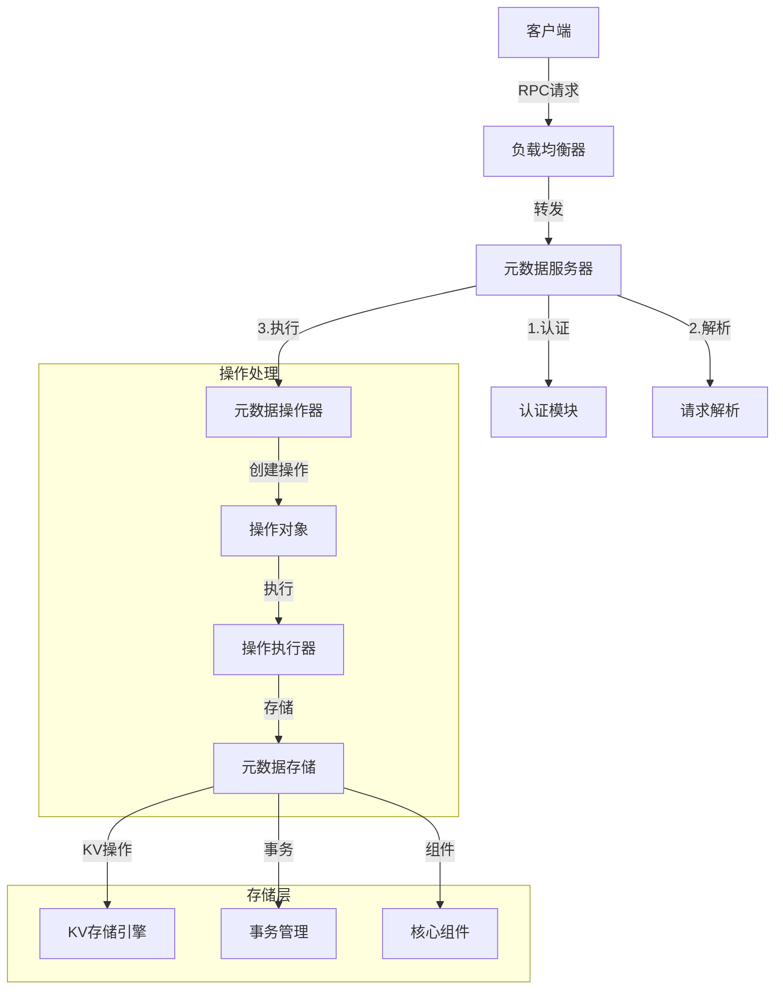
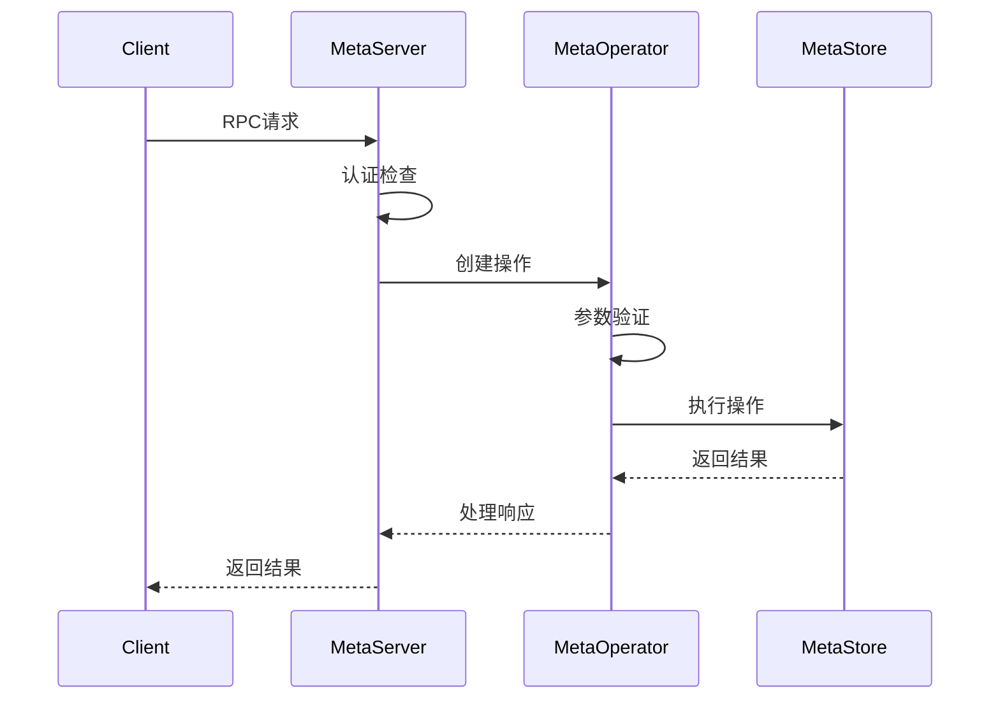
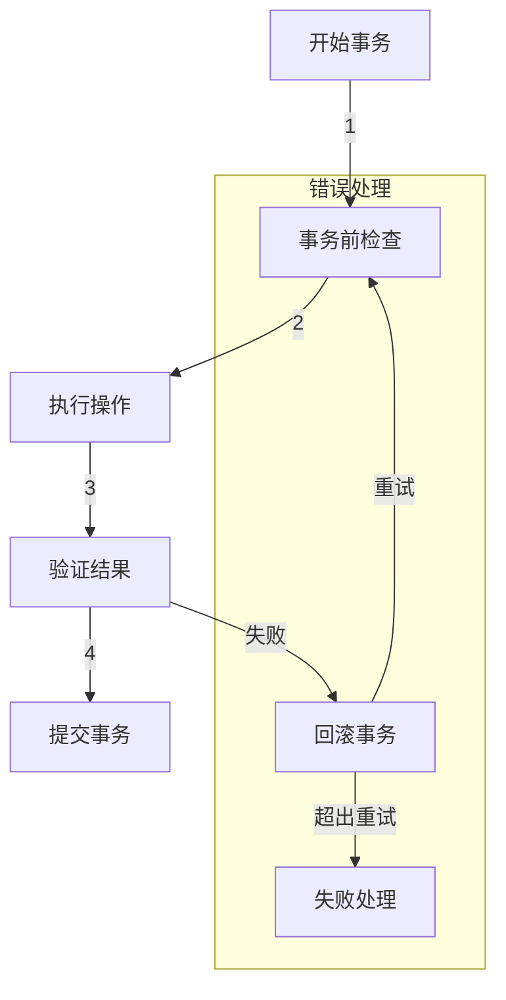

# 3FS 元数据服务模块分析文档

## 目录结构

```
src/meta/
├── meta.cpp          # 主入口文件
├── store/           # 存储相关实现
├── service/         # 服务相关实现
├── components/      # 组件相关实现
├── event/          # 事件相关实现
├── base/           # 基础设施实现
└── CMakeLists.txt  # 构建配置文件
```

## 模块分析

### 1. 主入口文件 (meta.cpp)

主入口文件实现了元数据服务的启动逻辑。主要特点：

1. 使用了 `TwoPhaseApplication` 模板类进行应用程序的初始化和运行
2. 主服务类为 `meta::server::MetaServer`
3. 采用了C++的临时对象语法来简化代码
4. 入口函数通过命令行参数来接收配置

关键依赖：
- common/app/TwoPhaseApplication.h
- memory/common/OverrideCppNewDelete.h
- meta/service/MetaServer.h

### 2. 存储模块 (store/)

存储模块是元数据服务的核心模块，负责管理文件系统的元数据。主要包含以下组件：

#### 2.1 核心存储引擎 (MetaStore.h/cc)

MetaStore 类是元数据存储的核心类，提供以下功能：
- 文件系统初始化
- 文件系统状态查询
- 文件和目录操作（创建、删除、重命名等）
- 权限管理
- 会话管理
- 垃圾回收

主要组件：
- Distributor：分发器
- InodeIdAllocator：inode ID分配器
- ChainAllocator：链式分配器
- FileHelper：文件操作助手
- SessionManager：会话管理器
- GcManager：垃圾回收管理器
- AclCache：访问控制列表缓存

#### 2.2 操作系统 (Operation.h)

定义了元数据服务支持的所有操作的基类和框架：

1. 基础操作接口 `IOperation<Rsp>`：
   - 定义了操作的基本接口
   - 支持只读/读写操作区分
   - 支持重试机制
   - 支持幂等性检查
   - 支持事件追踪

2. 通用操作基类 `Operation<Rsp>`：
   - 提供对元数据存储的访问
   - 管理操作相关的事件
   - 提供通用的辅助方法

3. 只读操作基类 `ReadOnlyOperation<Rsp>`：
   - 专门用于处理只读操作
   - 优化了事务处理

4. 操作执行器 `OperationDriver`：
   - 处理操作的执行流程
   - 支持超时控制
   - 支持重试策略
   - 支持幂等性检查
   - 支持事务提交
   - 支持性能监控

主要特性：
- 支持事务性操作
- 支持操作重试
- 支持幂等性
- 支持超时控制
- 支持性能监控
- 支持事件追踪
- 支持只读优化

#### 2.3 文件系统组件

store 目录下还包含多个重要的文件系统组件：

1. PathResolve (PathResolve.h/cc)：
   - 路径解析
   - 符号链接处理
   - 权限检查

2. Inode (Inode.h/cc)：
   - inode 管理
   - 文件属性管理

3. DirEntry (DirEntry.h/cc)：
   - 目录项管理
   - 目录遍历

4. FileSession (FileSession.h/cc)：
   - 文件会话管理
   - 文件锁管理

5. BatchContext (BatchContext.h)：
   - 批量操作支持
   - 性能优化

6. Utils (Utils.h)：
   - 通用工具函数
   - 辅助方法

### 3. 服务模块 (service/)

服务模块负责对外提供元数据服务的接口和实现。主要包含以下组件：

#### 3.1 元数据服务器 (MetaServer.h/cc)

MetaServer 类是元数据服务的主要服务器实现：

1. 配置系统：
   - CommonConfig：基础配置（日志等）
   - AppConfig：应用配置
   - LauncherConfig：启动器配置
   - Config：服务器主配置
     * 网络配置（端口、服务等）
     * 存储引擎配置
     * 客户端配置
     * 元数据服务配置

2. 服务生命周期管理：
   - 启动（start）
   - 停止前准备（beforeStop）
   - 停止后清理（afterStop）

3. 核心组件：
   - KV存储引擎
   - 后台客户端
   - 管理客户端
   - 元数据操作器

#### 3.2 元数据操作器 (MetaOperator.h/cc)

MetaOperator 类实现了所有元数据服务的具体操作：

1. 文件系统操作：
   - 认证（authenticate）
   - 文件系统状态（statFs）
   - 文件状态（stat）
   - 路径解析（getRealPath）
   - 文件操作（open, close, create）
   - 目录操作（mkdirs, list）
   - 链接操作（symlink, hardLink）
   - 删除和重命名（remove, rename）
   - 属性设置（setAttr）
   - 会话管理（pruneSession）
   - 批量操作（batchStat）

2. 批处理系统：
   - 支持操作批量处理
   - 提供批处理队列
   - 控制并发和超时
   - 优化性能

3. 组件集成：
   - 分发器
   - 用户存储
   - inode分配器
   - 链式分配器
   - 文件助手
   - 会话管理器
   - 垃圾回收管理器
   - 转发器

4. 性能优化：
   - 使用协程
   - 批量处理
   - 并发控制
   - 事件追踪

#### 3.3 服务接口序列化 (MetaSerdeService.h)

提供元数据服务的序列化和反序列化支持。

#### 3.4 测试支持 (MockMeta.h)

提供元数据服务的模拟实现，用于测试。

### 4. 组件模块 (components/)

组件模块提供了元数据服务的各个功能组件。主要包含以下组件：

#### 4.1 会话管理器 (SessionManager.h/cc)

负责管理文件系统的会话状态：

1. 配置系统：
   - 会话扫描间隔
   - 会话超时时间
   - 批处理大小
   - 工作线程池配置

2. 核心功能：
   - 会话创建和销毁
   - 会话超时检测
   - 会话清理
   - 批量操作支持

3. 任务系统：
   - 扫描任务
   - 关闭任务
   - 并发控制
   - 性能优化

#### 4.2 垃圾回收管理器 (GcManager.h/cc)

负责管理文件系统的垃圾回收：

1. 垃圾回收类型：
   - 目录（DIRECTORY）
   - 中型文件（FILE_MEDIUM）
   - 大型文件（FILE_LARGE）
   - 小型文件（FILE_SMALL）

2. 核心组件：
   - GcDirectory：垃圾回收目录管理
   - GcTask：垃圾回收任务
   - QueueState：队列状态管理

3. 主要功能：
   - 文件和目录的垃圾回收
   - 分布式垃圾回收
   - 优先级管理
   - 并发控制
   - 延迟处理
   - 批量处理

4. 性能优化：
   - 任务优先级
   - 并发限制
   - 批量处理
   - 分布式处理

#### 4.3 其他重要组件

1. FileHelper (FileHelper.h/cc)：
   - 文件操作辅助
   - 文件系统接口

2. Forward (Forward.h)：
   - 请求转发
   - 负载均衡

3. InodeIdAllocator (InodeIdAllocator.h/cc)：
   - inode ID分配
   - ID唯一性保证

4. AclCache (AclCache.h)：
   - 访问控制列表缓存
   - 权限检查优化

5. ChainAllocator (ChainAllocator.h)：
   - 链式资源分配
   - 资源管理

6. Distributor (Distributor.h/cc)：
   - 请求分发
   - 负载均衡

### 5. 事件模块 (event/)

事件模块负责处理元数据服务中的事件追踪和扫描功能。主要包含以下组件：

#### 5.1 事件系统 (Event.h/cc)

1. 事件类型：
   - Create：创建文件/目录
   - Mkdir：创建目录
   - HardLink：创建硬链接
   - Remove：删除文件/目录
   - Truncate：截断文件
   - OpenWrite：打开文件写入
   - CloseWrite：关闭文件写入
   - Rename：重命名
   - Symlink：创建符号链接
   - GC：垃圾回收

2. 事件数据结构：
   - 事件类型
   - 动态数据字段
   - 时间戳
   - 自定义字段支持

3. 事件追踪：
   - 事件类型
   - inode信息
   - 父目录信息
   - 用户信息
   - 客户端信息
   - 文件属性 
   - 操作标志
   - 路径信息

#### 5.2 扫描系统 (Scan.h/cc)

1. 扫描配置：
   - 线程数
   - 协程数
   - 批处理大小
   - 退避策略
   - 日志级别
   - 存储引擎配置

2. 扫描功能：
   - inode扫描
   - 目录项扫描
   - 范围扫描
   - 快照扫描

3. 性能优化：
   - 多线程支持
   - 协程支持
   - 批量处理
   - 退避策略
   - 取消支持
   - 队列管理

4. 关键组件：
   - KeyRange：键范围管理
   - BackgroundTask：后台任务
   - MetaScan：扫描管理器

5. 特点：
   - 支持并发扫描
   - 支持范围分片
   - 支持快照读取
   - 支持进度跟踪
   - 支持错误处理
   - 支持性能优化

### 6. 基础设施模块 (base/)

基础设施模块主要包含配置相关的定义，位于 `Config.h` 文件中。主要包括：

1. GC（垃圾回收）配置 `GcConfig`：
   - 支持热更新的配置项
   - 包含GC的启用/禁用控制
   - 扫描间隔和批次大小设置
   - 文件和目录GC的延迟和并发控制
   - 小文件和大文件的区分阈值
   - 工作线程池配置
   - 重试策略配置

2. 主配置类 `Config`：
   - 基本服务控制（只读模式、认证等）
   - 会话管理配置
   - 分发器配置
   - 转发配置
   - 事件追踪配置
   - 符号链接和目录深度限制
   - ACL缓存时间
   - 文件操作相关配置
   - 统计信息缓存
   - 递归删除控制
   - 幂等性操作控制
   - 用户缓存配置

特点：
- 采用模板类 `ConfigBase` 作为基类
- 大量使用热更新配置项
- 提供了详细的配置检查器
- 支持复杂的嵌套配置结构

### 7. 构建配置 (CMakeLists.txt)

构建配置文件定义了元数据服务的构建规则：

1. 库目标：
   - 目标名称：meta
   - 依赖库：
     * core-app：核心应用库
     * core-user：用户管理库
     * core-service：服务框架库
     * fdb：FoundationDB存储引擎
     * meta-fbs：元数据服务FlatBuffers
     * mgmtd-client：管理服务客户端
     * storage-client：存储服务客户端
     * memory-common：内存管理库
     * analytics：分析工具库

2. 可执行目标：
   - 目标名称：meta_main
   - 源文件：meta.cpp
   - 依赖库：
     * meta：元数据服务库
     * jemalloc：内存分配器

### 8. 元数据操作处理流程

#### 8.1 操作处理架构



#### 8.2 通信机制

1. 外部通信：
   - 基于 gRPC 的 RPC 框架
   - Protobuf 消息序列化
   - 支持双向流式通信
   - 负载均衡和服务发现

2. 内部通信：
   - 基于事件驱动的异步模型
   - 协程based的并发处理
   - 共享内存的组件间通信
   - 基于KV存储的持久化通信

#### 8.3 操作处理流程

1. 请求接收和解析：


2. 操作执行流程：
   - 认证和授权检查
   - 参数验证和规范化
   - 创建操作对象
   - 执行前检查（配额、权限等）
   - 事务处理
   - 结果处理和响应

#### 8.4 核心操作实现

1. 文件操作：
```cpp
// 文件创建流程
CoTryTask<CreateRsp> MetaOperator::create(CreateReq req) {
    // 1. 认证检查
    CO_RETURN_ON_ERROR(co_await authenticate(req.user));
    
    // 2. 创建操作对象
    auto op = metaStore_->create(req);
    
    // 3. 执行操作
    auto result = co_await runOp(std::move(op), req);
    
    // 4. 事件通知
    if (result) {
        eventTracer_.trace(Event::Create, result.value());
    }
    
    co_return result;
}
```

2. 目录操作：
```cpp
// 目录列举流程
CoTryTask<ListRsp> MetaOperator::list(ListReq req) {
    // 1. 认证检查
    CO_RETURN_ON_ERROR(co_await authenticate(req.user));
    
    // 2. 批量处理优化
    if (req.batch_size > 0) {
        return batchList(req);
    }
    
    // 3. 创建操作对象
    auto op = metaStore_->list(req);
    
    // 4. 执行操作
    co_return co_await runOp(std::move(op), req);
}
```

#### 8.5 性能优化机制

1. 批量处理优化：
   - 支持批量读写操作
   - 智能批处理大小调整
   - 异步批处理队列
   - 批处理超时控制

2. 缓存优化：
   - 多级缓存架构
   - 智能缓存预热
   - 缓存一致性保证
   - 缓存失效策略

3. 并发优化：
   - 协程池化
   - 细粒度锁
   - 无锁数据结构
   - 并发度控制

#### 8.6 可靠性保证

1. 事务保证：


2. 数据一致性：
   - 强一致性保证
   - 版本控制
   - 原子性操作
   - 故障恢复

3. 错误处理：
   - 全链路重试
   - 优雅降级
   - 故障隔离
   - 错误追踪

### 9. 监控和运维

#### 9.1 性能指标

1. 延迟指标：
   - 操作响应时间
   - 事务处理时间
   - 网络延迟
   - 存储延迟

2. 吞吐指标：
   - QPS/TPS
   - 带宽使用
   - 缓存命中率
   - 资源使用率

#### 9.2 运维特性

1. 配置管理：
   - 动态配置更新
   - 配置验证
   - 配置版本控制
   - 配置同步

2. 日志管理：
   - 分级日志
   - 结构化日志
   - 日志轮转
   - 审计日志

3. 监控告警：
   - 性能监控
   - 资源监控
   - 错误监控
   - 业务监控

## 总结

3FS的元数据服务模块是一个复杂而完整的分布式文件系统元数据管理服务。它具有以下主要特点：

1. 架构设计：
   - 模块化设计，职责分明
   - 高度可配置
   - 可扩展性好
   - 性能优化充分

2. 核心功能：
   - 文件系统元数据管理
   - 事务性操作支持
   - 分布式协调
   - 垃圾回收
   - 会话管理
   - 权限控制

3. 性能优化：
   - 批量处理
   - 并发控制
   - 缓存机制
   - 协程支持
   - 事件追踪

4. 可靠性保证：
   - 事务支持
   - 幂等性设计
   - 错误处理
   - 超时控制
   - 重试机制

5. 运维特性：
   - 配置热更新
   - 性能监控
   - 事件追踪
   - 调试支持

6. 技术栈：
   - 现代C++
   - FoundationDB
   - FlatBuffers
   - Folly库
   - CMake构建系统

这个模块展示了一个现代化的分布式系统设计，结合了高性能、可靠性和可维护性的多个方面。它的实现充分利用了现代C++的特性，并采用了多种优化技术来确保系统的高效运行。 