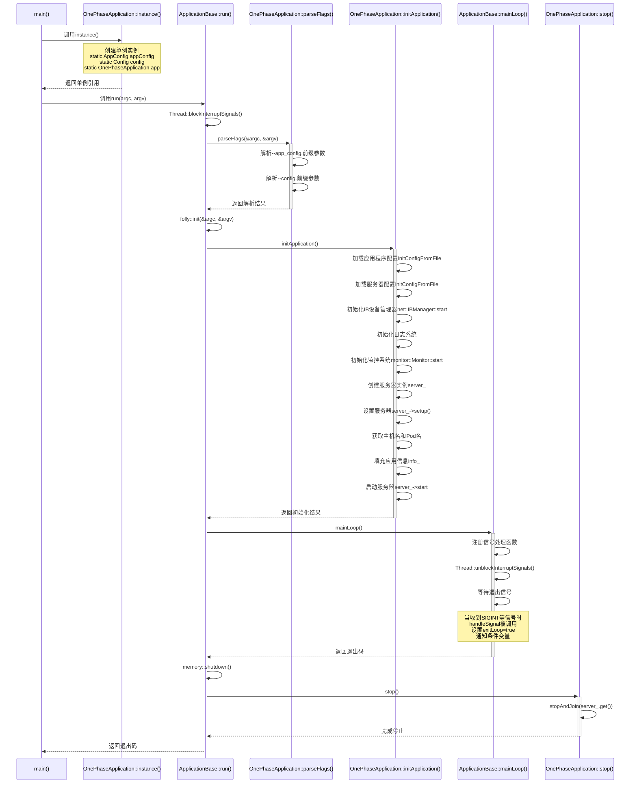

# C++应用程序框架设计与实现分析

## 引言

本文深入分析了一个基于C++的应用程序框架设计，以`hf3fs::OnePhaseApplication<hf3fs::monitor::MonitorCollectorServer>::instance().run(argc, argv)`这行代码为切入点，详细讲解了其背后的设计模式、C++特性以及执行流程。这种框架设计在大型C++项目中非常常见，理解它有助于我们掌握C++高级编程技巧和软件架构设计思想。

## 一、ApplicationBase类分析

### 1.1 类概述

`ApplicationBase`是一个抽象基类，为应用程序提供了基本的生命周期管理和配置处理框架。它采用模板方法设计模式，定义了应用程序的基本骨架，而具体的实现细节则由子类通过重写虚函数来提供。

### 1.2 主要属性

虽然在代码中没有直接列出所有成员变量，但从实现可以推断出以下关键属性：

1. **全局应用程序指针**：在命名空间内部维护了一个全局的`ApplicationBase`指针`globalApp`，用于管理全局唯一的应用程序实例。

2. **主循环控制变量**：
   - `exitLoop`：控制主循环是否退出的原子布尔值
   - `exitCode`：应用程序退出码的原子整数值

3. **互斥锁**：
   - `appMutex`：保护全局应用程序指针的互斥锁
   - `loopMutex`：保护主循环的互斥锁

4. **条件变量**：
   - `loopCv`：用于主循环等待的条件变量

### 1.3 公共方法

1. **运行应用程序**：
   ```cpp
   int run(int argc, char *argv[]);
   ```
   应用程序的主入口点，负责调用整个应用程序生命周期的各个阶段。

2. **信号处理**：
   ```cpp
   static void handleSignal(int signum);
   ```
   处理SIGINT、SIGTERM等信号，实现应用程序的优雅关闭。

3. **配置管理**：
   ```cpp
   static Result<Void> parseFlags(std::string_view prefix, int *argc, char ***argv, ConfigFlags &flags);
   static Result<Void> initConfig(config::IConfig &cfg, const String &path, bool dump, const std::vector<config::KeyValue> &flags);
   static Result<Void> loadConfig(config::IConfig &cfg, const String &path, const std::vector<config::KeyValue> &flags);
   static Result<Void> updateConfig(const String &configContent, const String &configDesc);
   static Result<Void> hotUpdateConfig(const String &update, bool render);
   static Result<Void> validateConfig(const String &configContent, const String &configDesc);
   static Result<String> getConfigString(std::string_view configKey);
   static Result<std::pair<String, Result<String>>> renderConfig(const String &configContent, bool testUpdate, bool isHotUpdate);
   ```
   这些方法提供了完整的配置管理功能，包括解析命令行参数、加载配置文件、更新配置、热更新配置、验证配置等。

4. **应用信息获取**：
   ```cpp
   static std::optional<flat::AppInfo> getAppInfo();
   static std::optional<app::ConfigUpdateRecord> getLastConfigUpdateRecord();
   static ConfigStatus getConfigStatus();
   ```
   这些方法用于获取应用程序的信息、配置更新记录和配置状态。

### 1.4 受保护方法

1. **构造函数和析构函数**：
   ```cpp
   ApplicationBase();
   ~ApplicationBase() = default;
   ```
   构造函数将当前应用实例注册为全局应用。

2. **虚函数**：
   ```cpp
   virtual void stop() = 0;
   virtual int mainLoop();
   virtual Result<Void> parseFlags(int *argc, char ***argv) = 0;
   virtual Result<Void> initApplication() = 0;
   virtual config::IConfig *getConfig() = 0;
   virtual const flat::AppInfo *info() const;
   virtual bool configPushable() const;
   virtual void onConfigUpdated();
   ```
   这些虚函数定义了应用程序的基本骨架，其中一些是纯虚函数，必须由子类实现；而其他则提供了默认实现，子类可以选择性地重写。

### 1.5 嵌套类型

1. **配置结构**：
   ```cpp
   struct Config : public ConfigBase<Config> {
     CONFIG_OBJ(log, logging::LogConfig);
     CONFIG_OBJ(monitor, monitor::Monitor::Config);
     CONFIG_OBJ(memory, memory::MemoryAllocatorConfig);
   };
   ```
   定义了应用程序的基础配置结构，包含日志、监控和内存分配器的基本配置项。

2. **配置标志类型**：
   ```cpp
   using ConfigFlags = std::vector<config::KeyValue>;
   ```
   用于存储配置标志的类型别名。

### 1.6 全局函数

```cpp
void stopAndJoin(net::Server *server);
```
停止服务器并等待其完全关闭，同时清理监控和IB管理器。

## 二、OnePhaseApplication模板类分析

### 2.1 类概述

`OnePhaseApplication`是`ApplicationBase`的模板子类，实现了一个简单的单阶段应用程序框架。它通过模板参数接收一个服务器类型，并提供了标准化的配置管理和应用程序生命周期管理。该类使用单例模式，确保应用程序实例的全局唯一性。

### 2.2 模板参数约束

```cpp
template <class T>
requires requires {
  typename T::Config;
  std::string_view(T::kName);
}
class OnePhaseApplication : public ApplicationBase { ... }
```

这里使用了C++20的概念(Concepts)特性，要求模板参数T必须：
- 包含一个名为`Config`的类型
- 提供一个名为`kName`的字符串视图常量

### 2.3 嵌套配置类

`OnePhaseApplication`定义了三个嵌套的配置类：

1. **CommonConfig**：通用配置类，包含集群ID、日志、监控和IB设备的配置项
2. **Config**：应用程序配置类，包含通用配置和服务器特定配置
3. **AppConfig**：应用程序基础配置结构，包含节点ID和是否允许空节点ID的配置项

### 2.4 单例实现

```cpp
static OnePhaseApplication &instance() {
  static AppConfig appConfig;
  static Config config;
  static OnePhaseApplication app(appConfig, config);
  return app;
}
```

这里使用了C++11引入的局部静态变量线程安全初始化特性，编译器会自动处理线程安全问题，确保`app`只被初始化一次。

### 2.5 虚函数实现

`OnePhaseApplication`实现了`ApplicationBase`中定义的所有纯虚函数：

1. **parseFlags**：解析应用程序配置和服务器配置的命令行参数
2. **initApplication**：完成应用程序的初始化，包括加载配置、初始化组件和启动服务器
3. **getConfig**：返回配置对象指针
4. **info**：返回应用信息指针
5. **stop**：停止应用程序

## 三、C++语言特性分析

### 3.1 模板与概念

`OnePhaseApplication`使用了模板和C++20的概念特性，这允许我们：

1. **编写泛型代码**：通过模板参数T，可以适配不同类型的服务器
2. **强制约束**：通过概念约束，确保模板参数满足特定要求
3. **提高代码可读性**：明确表达了对模板参数的期望

### 3.2 单例模式

单例模式确保了应用程序实例的全局唯一性，C++11后的实现方式有以下优点：

1. **线程安全**：编译器保证静态局部变量的初始化是线程安全的
2. **懒加载**：只有在首次调用`instance()`时才会创建实例
3. **自动销毁**：程序结束时会自动调用析构函数

### 3.3 智能指针

```cpp
std::unique_ptr<net::Server> server_;
```

使用`unique_ptr`管理服务器实例，确保资源的自动释放，避免内存泄漏。

### 3.4 RAII原则

整个框架遵循RAII(Resource Acquisition Is Initialization)原则，资源的获取和释放与对象的生命周期绑定，确保资源的安全管理。

## 四、执行流程详解

### 4.1 单例实例获取

当调用`OnePhaseApplication<...>::instance()`时：

1. 首次调用时，会创建静态局部变量：
   - `static AppConfig appConfig` - 应用配置对象
   - `static Config config` - 服务器配置对象
   - `static OnePhaseApplication app(appConfig, config)` - 应用程序实例

2. 构造函数执行：
   ```cpp
   OnePhaseApplication(AppConfig &appConfig, Config &config)
       : appConfig_(appConfig), config_(config) {}
   ```
   
3. 基类构造函数执行：
   ```cpp
   ApplicationBase::ApplicationBase() { globalApp = this; }
   ```
   将当前实例注册为全局应用程序

### 4.2 run方法执行

获取实例后，调用`run(argc, argv)`方法，这是在基类`ApplicationBase`中定义的。该方法执行以下步骤：

1. **阻塞中断信号**：确保初始化过程不会被中断
2. **解析命令行参数**：调用`parseFlags`方法解析命令行参数
3. **初始化folly库**：初始化底层组件库
4. **检查版本标志**：如果指定了版本标志，则打印版本信息并退出
5. **初始化应用程序**：调用`initApplication`方法完成核心初始化
6. **进入主循环**：调用`mainLoop`方法等待退出信号
7. **清理资源**：关闭内存管理器并停止服务器
8. **返回退出码**：完成整个应用程序的生命周期

### 4.3 initApplication方法执行

`initApplication`方法是`OnePhaseApplication`中最核心的方法，它完成了以下初始化工作：

1. **加载配置**：从文件和命令行参数加载应用程序配置和服务器配置
2. **初始化组件**：初始化IB设备管理器、日志系统和监控系统
3. **创建服务器**：创建并设置服务器实例
4. **填充应用信息**：获取主机名、Pod名等信息，并填充到应用信息对象中
5. **启动服务器**：启动服务器并处理可能的错误

### 4.4 主循环与信号处理

`mainLoop`方法设置信号处理并等待退出信号：

1. **注册信号处理函数**：为SIGINT、SIGTERM等信号注册处理函数
2. **解除信号阻塞**：允许信号被处理
3. **等待退出信号**：通过条件变量等待退出信号

当收到信号时，`handleSignal`函数会被调用，它会设置`exitLoop`为true并通知条件变量，从而使主循环退出。

### 4.5 资源清理

主循环退出后，进行资源清理：

1. **关闭内存管理器**：调用`memory::shutdown()`
2. **停止服务器**：调用`stop()`方法，它会进一步调用`stopAndJoin`函数
3. **清理其他资源**：停止监控系统和IB管理器

## 五、设计模式分析

这个应用程序框架使用了多种设计模式：

### 5.1 单例模式

通过`instance()`方法确保应用程序实例的全局唯一性，避免了多个应用程序实例的冲突。

### 5.2 模板方法模式

`ApplicationBase`定义了应用程序的基本骨架（`run`方法），而具体的实现细节（如`parseFlags`、`initApplication`等）则由子类提供。这种设计使得框架具有高度的可扩展性和灵活性。

### 5.3 工厂方法模式

子类负责创建具体的配置对象和服务器实例，这是工厂方法模式的应用。通过这种方式，框架可以适应不同类型的服务器和配置。

### 5.4 观察者模式

通过`onConfigUpdated`回调允许子类在配置更新后执行特定操作，这是观察者模式的简化应用。

### 5.5 命令模式

信号处理函数作为命令，可以触发应用程序的退出。这种设计将请求封装为对象，使得请求的发送者和接收者解耦。

## 六、执行流程图



## 七、总结与最佳实践

### 7.1 框架设计的优点

1. **高度抽象**：通过抽象基类和虚函数，提供了清晰的接口和扩展点
2. **可重用性**：通过模板和多态，实现了高度的代码重用
3. **资源安全**：通过RAII和智能指针，确保资源的安全管理
4. **配置灵活**：支持从文件和命令行加载配置，并支持热更新
5. **优雅关闭**：通过信号处理，实现了应用程序的优雅关闭

### 7.2 C++最佳实践

1. **使用现代C++特性**：模板、概念、智能指针、RAII等
2. **遵循设计模式**：单例、模板方法、工厂方法等
3. **资源管理**：使用智能指针和RAII管理资源
4. **错误处理**：使用Result类型返回错误，而不是异常
5. **线程安全**：使用互斥锁和条件变量确保线程安全

### 7.3 应用场景

这种应用程序框架适用于以下场景：

1. **服务器应用**：需要长时间运行的服务器程序
2. **配置驱动**：配置复杂且可能需要热更新的应用
3. **组件化系统**：由多个组件组成的复杂系统
4. **高可靠性要求**：需要优雅关闭和资源安全管理的应用

通过这种框架，开发者可以专注于业务逻辑的实现，而不需要关心应用程序的生命周期管理和配置管理等通用功能。
