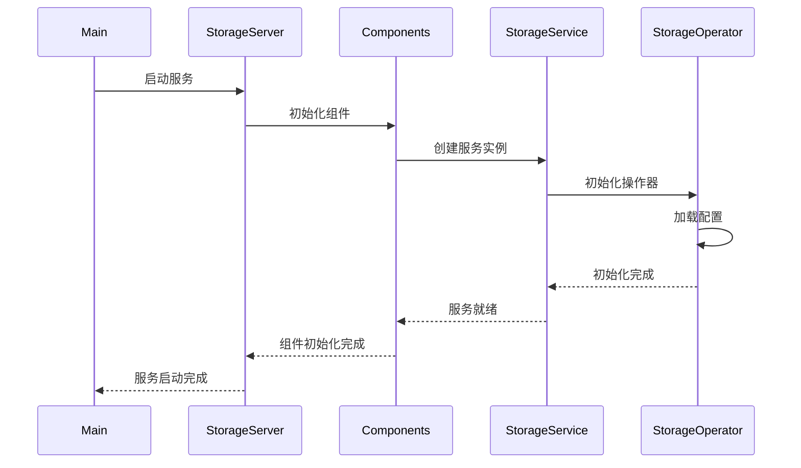
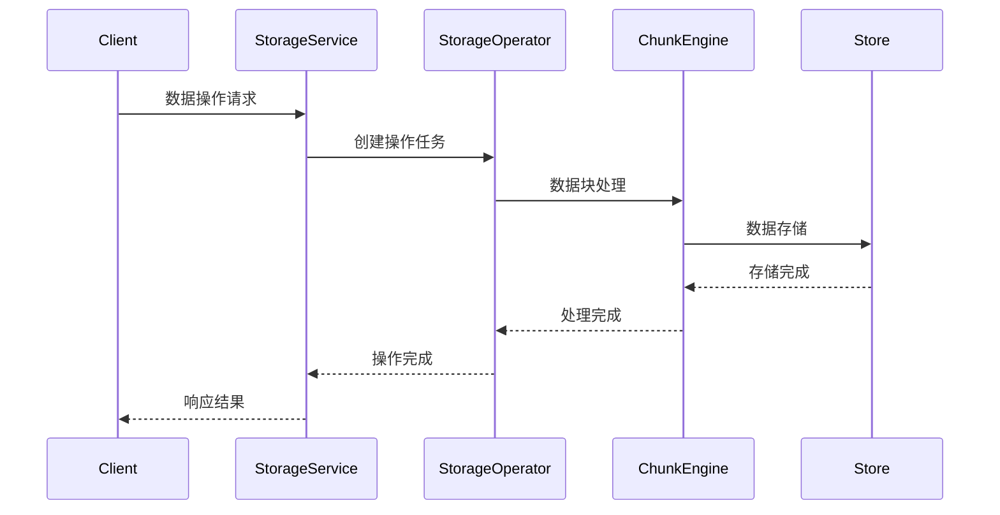
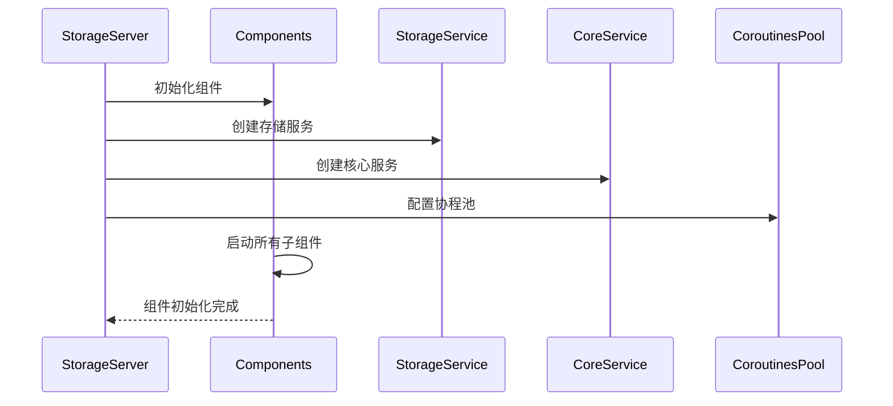
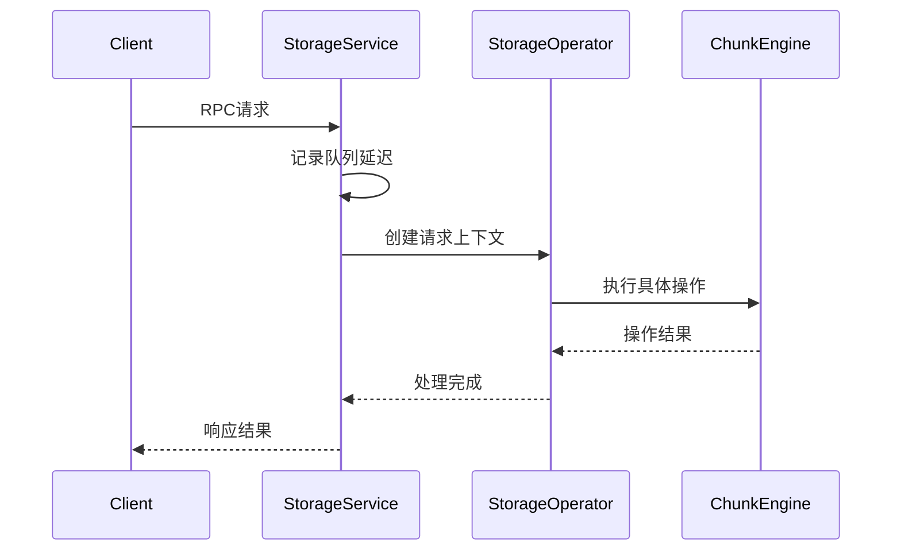
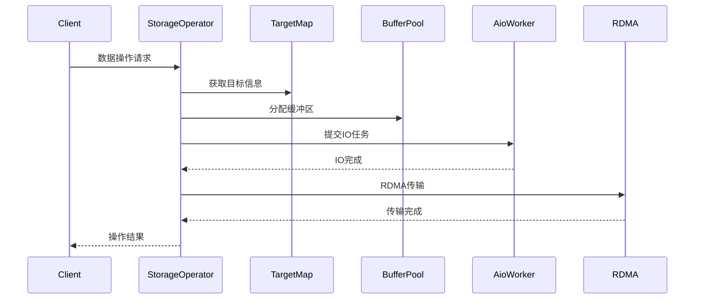
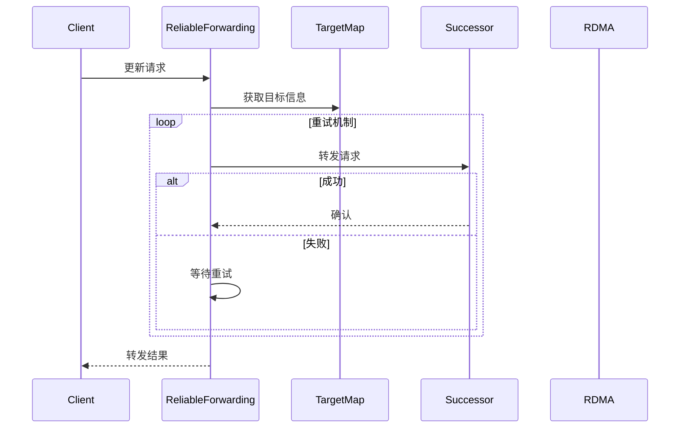
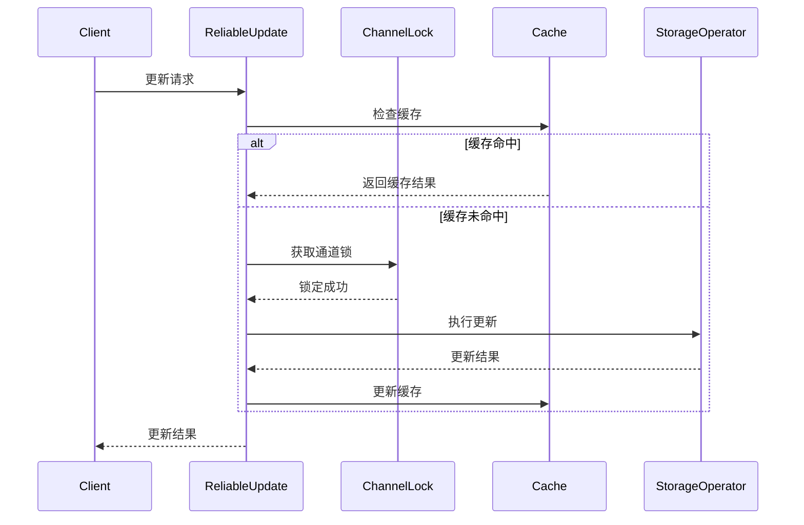
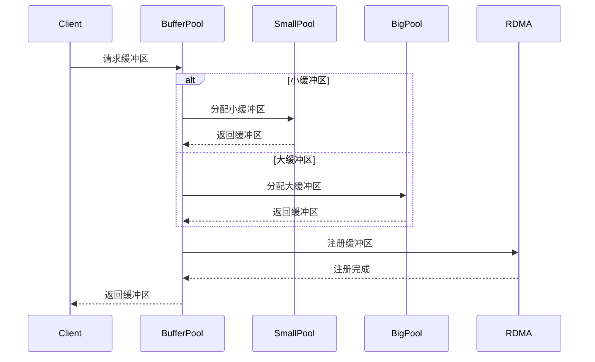

# 3FS Storage模块分析文档

## 1. 模块概述

3FS Storage模块是3FS分布式文件系统的核心数据服务模块，负责数据的存储、同步和更新等核心功能。该模块采用多组件架构设计，各个组件之间通过清晰的接口进行交互。

## 2. 目录结构

```
src/storage/
├── aio/           # 异步IO操作相关实现
├── chunk_engine/  # 数据块引擎实现
├── service/       # 核心服务实现
├── store/         # 数据存储实现
├── sync/          # 数据同步实现
├── update/        # 数据更新实现
├── worker/        # 工作线程实现
├── storage.cpp    # 主程序入口
└── CMakeLists.txt # 构建配置文件
```

## 3. 核心组件

### 3.1 服务层组件

服务层是Storage模块的最顶层，主要包含以下组件：

- `StorageServer`: 存储服务器主类，负责服务的启动和生命周期管理
- `StorageService`: 存储服务核心类，提供基础服务接口
- `StorageOperator`: 存储操作执行器，处理具体的存储操作
- `TargetMap`: 目标映射管理，负责管理存储目标
- `Components`: 组件管理，负责各个子组件的初始化和生命周期管理

### 3.2 可靠性组件

- `ReliableForwarding`: 可靠转发实现
- `ReliableUpdate`: 可靠更新实现
- `BufferPool`: 缓冲区池管理

## 4. 服务启动流程



## 5. 数据操作流程



## 6. 待续...

本文档将持续更新，后续将详细分析各个子模块的具体实现。

## 7. StorageServer详细分析

### 7.1 类结构

StorageServer是Storage模块的核心服务器类，继承自net::Server，负责整个存储服务的生命周期管理。主要特点：

- 使用模板化的配置系统
- 支持远程配置获取
- 采用组件化架构设计
- 实现了完整的服务生命周期管理

### 7.2 核心方法

#### 7.2.1 生命周期管理
```cpp
Result<Void> beforeStart()      // 服务启动前准备
Result<Void> beforeStop()       // 服务停止前清理
Result<Void> afterStop()        // 服务停止后清理
```

#### 7.2.2 服务启动流程
```cpp
Result<Void> start(const flat::AppInfo &info,
                   std::unique_ptr<::hf3fs::net::Client> client,
                   std::shared_ptr<::hf3fs::client::MgmtdClient> mgmtdClient)
```

### 7.3 组件初始化流程



### 7.4 关键特性

1. **服务注册**
   - 注册StorageService作为主要服务
   - 注册CoreService作为基础服务
   - 支持动态协程池分配

2. **组件管理**
   - 通过Components类统一管理所有子组件
   - 支持组件的生命周期管理
   - 提供可靠的组件间通信机制

3. **网络通信**
   - 支持客户端连接管理
   - 集成管理客户端(MgmtdClient)
   - 提供网络服务的基础设施

4. **可靠性保证**
   - 实现了可靠转发(ReliableForwarding)
   - 实现了可靠更新(ReliableUpdate)
   - 提供了完整的错误处理机制

### 7.5 配置系统

StorageServer使用多层配置系统：

1. **基础配置**
   ```cpp
   using CommonConfig = ApplicationBase::Config;
   using Config = Components::Config;
   ```

2. **启动器配置**
   ```cpp
   struct LauncherConfig : public core::ServerLauncherConfig {
     LauncherConfig() { mgmtd_client() = hf3fs::client::MgmtdClientForServer::Config{}; }
   };
   ```

3. **远程配置**
   ```cpp
   using RemoteConfigFetcher = core::launcher::ServerMgmtdClientFetcher;
   ```

### 7.6 错误处理

StorageServer实现了完整的错误处理机制：

1. 使用Result类型包装所有操作结果
2. 提供详细的错误日志记录
3. 支持优雅的服务停止和清理

## 8. 待续...

本文档将持续更新，后续将详细分析StorageService和StorageOperator的实现。

## 9. StorageService详细分析

### 9.1 类结构

StorageService是Storage模块的核心服务类，继承自serde::ServiceWrapper，提供了存储服务的所有RPC接口。主要特点：

- 采用协程异步编程模型
- 支持批量操作
- 提供完整的监控指标
- 实现了请求上下文管理

### 9.2 核心接口

#### 9.2.1 数据操作接口
```cpp
CoTryTask<BatchReadRsp> batchRead(...)    // 批量读取
CoTryTask<WriteRsp> write(...)            // 写入操作
CoTryTask<UpdateRsp> update(...)          // 更新操作
```

#### 9.2.2 数据块管理接口
```cpp
CoTryTask<QueryLastChunkRsp> queryLastChunk(...)    // 查询最后数据块
CoTryTask<TruncateChunksRsp> truncateChunks(...)    // 截断数据块
CoTryTask<RemoveChunksRsp> removeChunks(...)        // 删除数据块
```

#### 9.2.3 同步管理接口
```cpp
CoTryTask<TargetSyncInfo> syncStart(...)    // 开始同步
CoTryTask<SyncDoneRsp> syncDone(...)        // 同步完成
```

#### 9.2.4 目标管理接口
```cpp
CoTryTask<CreateTargetRsp> createTarget(...)    // 创建目标
CoTryTask<OfflineTargetRsp> offlineTarget(...)  // 目标下线
CoTryTask<RemoveTargetRsp> removeTarget(...)    // 删除目标
```

### 9.3 性能监控

StorageService实现了三种队列延迟监控：

1. **读取队列延迟**
```cpp
monitor::LatencyRecorder readQueueLatency{"storage.read.queue_latency"};
```

2. **更新队列延迟**
```cpp
monitor::LatencyRecorder updateQueueLatency{"storage.update.queue_latency"};
```

3. **默认队列延迟**
```cpp
monitor::LatencyRecorder defaultQueueLatency{"storage.default.queue_latency"};
```

### 9.4 请求处理流程



### 9.5 关键特性

1. **异步处理**
   - 使用协程实现异步操作
   - 支持批量请求处理
   - 提供请求重试机制

2. **上下文管理**
   - 维护请求上下文信息
   - 支持调试标志
   - 记录用户信息

3. **性能监控**
   - 队列延迟监控
   - 操作延迟统计
   - 性能指标收集

4. **错误处理**
   - 使用CoTryTask处理异常
   - 支持请求重试
   - 提供详细的错误信息

### 9.6 请求上下文

每个请求都包含以下上下文信息：
```cpp
struct ServiceRequestContext {
    std::string operation;      // 操作名称
    uint64_t tag;              // 请求标签
    uint32_t retryCount;       // 重试次数
    UserInfo userInfo;         // 用户信息
    DebugFlags debugFlags;     // 调试标志
};
```

## 10. 待续...

本文档将持续更新，后续将详细分析StorageOperator的实现。

## 11. StorageOperator详细分析

### 11.1 类结构

StorageOperator是Storage模块的核心操作类，负责处理所有存储相关的具体操作。主要特点：

- 支持RDMA操作
- 实现了完整的监控指标
- 提供批量操作支持
- 支持异步IO操作

### 11.2 配置系统

StorageOperator使用灵活的配置系统：

```cpp
class Config : public ConfigBase<Config> {
    CONFIG_OBJ(write_worker, UpdateWorker::Config);
    CONFIG_OBJ(event_trace_log, analytics::StructuredTraceLog<StorageEventTrace>::Config);
    CONFIG_HOT_UPDATED_ITEM(max_num_results_per_query, uint32_t{100});
    CONFIG_HOT_UPDATED_ITEM(batch_read_job_split_size, uint32_t{1024});
    CONFIG_HOT_UPDATED_ITEM(post_buffer_per_bytes, 64_KB);
    CONFIG_HOT_UPDATED_ITEM(batch_read_ignore_chain_version, false);
    CONFIG_HOT_UPDATED_ITEM(max_concurrent_rdma_writes, 256U);
    CONFIG_HOT_UPDATED_ITEM(max_concurrent_rdma_reads, 256U);
    CONFIG_HOT_UPDATED_ITEM(read_only, false);
    CONFIG_HOT_UPDATED_ITEM(rdma_transmission_req_timeout, 0_ms);
    CONFIG_HOT_UPDATED_ITEM(apply_transmission_before_getting_semaphore, true);
};
```

### 11.3 核心操作

#### 11.3.1 数据读取操作
```cpp
CoTryTask<BatchReadRsp> batchRead(ServiceRequestContext &requestCtx,
                                  const BatchReadReq &req,
                                  serde::CallContext &ctx);
```

#### 11.3.2 数据写入操作
```cpp
CoTryTask<WriteRsp> write(ServiceRequestContext &requestCtx,
                          const WriteReq &req,
                          net::IBSocket *ibSocket);
```

#### 11.3.3 数据更新操作
```cpp
CoTryTask<UpdateRsp> update(ServiceRequestContext &requestCtx,
                            const UpdateReq &req,
                            net::IBSocket *ibSocket);
```

### 11.4 性能监控

StorageOperator实现了全面的性能监控指标：

1. **IO操作监控**
```cpp
monitor::OperationRecorder storageAioEnqueueRecoder{"storage.aio_enqueue"};
monitor::OperationRecorder storageWaitAioRecoder{"storage.wait_aio"};
monitor::OperationRecorder storageWaitSemRecoder{"storage.wait_sem"};
```

2. **批量操作监控**
```cpp
monitor::OperationRecorder storageWaitBatchRecoder{"storage.wait_batch"};
monitor::OperationRecorder storageWaitPostRecoder{"storage.wait_post"};
```

3. **读写统计**
```cpp
monitor::CountRecorder storageReadCount{"storage.read.count"};
monitor::CountRecorder storageReadBytes{"storage.read.bytes"};
monitor::CountRecorder storageWriteBytes{"storage.req_write.bytes"};
```

### 11.5 RDMA操作管理

1. **并发控制**
```cpp
std::map<uint8_t, hf3fs::Semaphore> concurrentRdmaWriteSemaphore_;
std::map<uint8_t, hf3fs::Semaphore> concurrentRdmaReadSemaphore_;
```

2. **缓冲区管理**
```cpp
auto buffer = components_.rdmabufPool.get();
```

### 11.6 数据操作流程



### 11.7 错误处理

StorageOperator实现了完整的错误处理机制：

1. **错误注入支持**
```cpp
FAULT_INJECTION_POINT(requestCtx.debugFlags.injectServerError(),
                      makeError(StorageCode::kChainVersionMismatch),
                      snapshot->getByChainId(...))
```

2. **错误传播**
```cpp
if (UNLIKELY(!targetResult)) {
    auto msg = fmt::format("read get target failed, req {}, error {}", 
                          it->readIO(), targetResult.error());
    XLOG(ERR, msg);
    co_return makeError(std::move(targetResult.error()));
}
```

### 11.8 关键特性

1. **批量处理**
   - 支持批量读取操作
   - 支持批量写入操作
   - 支持批量更新操作

2. **RDMA优化**
   - 支持RDMA传输
   - 实现了并发控制
   - 提供缓冲区管理

3. **性能优化**
   - 异步IO操作
   - 批量任务处理
   - 并发控制

4. **可靠性保证**
   - 完整的错误处理
   - 事务支持
   - 状态检查

## 12. 待续...

本文档将持续更新，后续将详细分析其他组件的实现。

## 13. ReliableForwarding详细分析

### 13.1 类结构

ReliableForwarding是Storage模块的可靠转发组件，负责确保数据更新请求能够可靠地转发到目标节点。主要特点：

- 支持重试机制
- 实现了链式版本控制
- 提供同步状态管理
- 支持RDMA传输

### 13.2 配置系统

ReliableForwarding使用灵活的配置系统：

```cpp
struct Config : ConfigBase<Config> {
    CONFIG_HOT_UPDATED_ITEM(retry_first_wait, 100_ms);
    CONFIG_HOT_UPDATED_ITEM(retry_max_wait, 1000_ms);
    CONFIG_HOT_UPDATED_ITEM(retry_total_time, 60_s);
    CONFIG_HOT_UPDATED_ITEM(max_inline_forward_bytes, Size{});
};
```

### 13.3 核心方法

#### 13.3.1 带重试的转发
```cpp
CoTask<IOResult> forwardWithRetry(ServiceRequestContext &requestCtx,
                                  const UpdateReq &req,
                                  const net::RDMARemoteBuf &rdmabuf,
                                  const ChunkEngineUpdateJob &chunkEngineJob,
                                  TargetPtr &target,
                                  CommitIO &commitIO,
                                  bool allowOutdatedChainVer = true);
```

#### 13.3.2 单次转发
```cpp
CoTask<IOResult> forward(const UpdateReq &req,
                         uint32_t retryCount,
                         const net::RDMARemoteBuf &rdmabuf,
                         const ChunkEngineUpdateJob &chunkEngineJob,
                         TargetPtr &target,
                         CommitIO &commitIO,
                         std::chrono::milliseconds timeout);
```

#### 13.3.3 实际转发实现
```cpp
CoTask<IOResult> doForward(const UpdateReq &req,
                           const net::RDMARemoteBuf &rdmabuf,
                           const ChunkEngineUpdateJob &chunkEngineJob,
                           uint32_t retryCount,
                           const Target &target,
                           bool &isSyncing,
                           std::chrono::milliseconds timeout);
```

### 13.4 性能监控

ReliableForwarding实现了全面的性能监控指标：

1. **操作监控**
```cpp
monitor::OperationRecorder reliableForwardRecorder("storage.reliable_forward");
monitor::OperationRecorder syncingReadRecorder("storage.syncing_read");
monitor::OperationRecorder updateRemoteRecorder("storage.update_remote");
```

2. **数据统计**
```cpp
monitor::CountRecorder forwardWriteBytes("storage.forward.write_bytes");
monitor::DistributionRecorder forwardWriteDist("storage.forward.write_dist");
monitor::CountRecorder forwardSyncingBytes("storage.forward.syncing_bytes");
```

### 13.5 转发流程



### 13.6 关键特性

1. **重试机制**
   - 使用指数退避算法
   - 支持最大重试时间限制
   - 可配置重试间隔

2. **版本控制**
   - 维护链式版本信息
   - 处理版本不匹配情况
   - 支持版本同步

3. **同步管理**
   - 处理目标节点同步状态
   - 支持同步期间的读写操作
   - 维护同步进度

4. **RDMA优化**
   - 支持RDMA传输
   - 优化数据传输效率
   - 处理传输超时

### 13.7 错误处理

ReliableForwarding实现了完整的错误处理机制：

1. **错误类型**
```cpp
- StorageCode::kNoSuccessorTarget
- StorageCode::kChainVersionMismatch
- RPCCode::kTimeout
- RPCCode::kRequestRefused
```

2. **错误恢复**
```cpp
if (LIKELY(bool(ioResult.lengthInfo))) {
    // 处理成功情况
} else if (ioResult.lengthInfo.error().code() == StorageCode::kNoSuccessorTarget) {
    // 处理无后继目标情况
} else {
    // 处理其他错误
}
```

### 13.8 同步机制

1. **同步状态检查**
```cpp
isSyncing = target.successor->targetInfo.publicState == 
            hf3fs::flat::PublicTargetState::SYNCING;
```

2. **同步数据读取**
```cpp
bool readForSyncing = req.payload.isWriteTruncateExtend() && 
                     isSyncing &&
                     (req.options.isSyncing || 
                      req.payload.length != req.payload.chunkSize);
```

## 14. 待续...

本文档将持续更新，后续将详细分析其他组件的实现。

## 15. ReliableUpdate详细分析

### 15.1 类结构

ReliableUpdate是Storage模块的可靠更新组件，负责确保数据更新操作的可靠性和一致性。主要特点：

- 支持请求去重
- 实现了通道锁定机制
- 提供客户端状态管理
- 支持缓存结果

### 15.2 配置系统

ReliableUpdate使用简单的配置系统：

```cpp
struct Config : ConfigBase<Config> {
    CONFIG_HOT_UPDATED_ITEM(clean_up_expired_clients, false);
    CONFIG_HOT_UPDATED_ITEM(expired_clients_timeout, 1_h);
};
```

### 15.3 核心数据结构

#### 15.3.1 请求结果
```cpp
struct ReqResult {
    SERDE_STRUCT_FIELD(channelSeqnum, ChannelSeqNum{0});
    SERDE_STRUCT_FIELD(requestId, RequestId{0});
    SERDE_STRUCT_FIELD(updateResult, IOResult{});
    SERDE_STRUCT_FIELD(succUpdateVer, ChunkVer{});
    SERDE_STRUCT_FIELD(generationId, uint32_t{});
};
```

#### 15.3.2 客户端状态
```cpp
struct ClientStatus {
    std::unordered_map<std::pair<ChainId, ChannelId>, ReqResult> channelMap;
    UtcTime lastUsedTime;
};
```

### 15.4 核心方法

#### 15.4.1 更新操作
```cpp
CoTask<IOResult> update(ServiceRequestContext &requestCtx,
                        UpdateReq &req,
                        net::IBSocket *ibSocket,
                        TargetPtr &target);
```

#### 15.4.2 清理过期客户端
```cpp
Result<Void> cleanUpExpiredClients(
    const robin_hood::unordered_set<std::string> &activeClients);
```

### 15.5 性能监控

ReliableUpdate实现了全面的性能监控指标：

1. **操作监控**
```cpp
monitor::OperationRecorder reliableUpdateRecorder{"storage.reliable_update"};
monitor::OperationRecorder waitChannelLockRecorder{"storage.wait_channel_lock"};
```

2. **统计指标**
```cpp
monitor::CountRecorder reliableUpdateWaited{"storage.reliable_update.waited"};
monitor::CountRecorder reliableUpdateDuplidate{"storage.reliable_update.duplicate"};
monitor::CountRecorder reliableUpdateCached{"storage.reliable_update.cached"};
```

### 15.6 更新流程



### 15.7 关键特性

1. **请求去重**
   - 基于通道序列号
   - 支持请求ID验证
   - 处理重复请求

2. **通道锁定**
   - 使用协程锁
   - 支持超时机制
   - 防止并发更新

3. **结果缓存**
   - 缓存成功结果
   - 支持版本验证
   - 处理缓存不一致

4. **客户端管理**
   - 跟踪客户端状态
   - 清理过期客户端
   - 维护使用时间

### 15.8 错误处理

ReliableUpdate实现了完整的错误处理机制：

1. **错误类型**
```cpp
- StorageCode::kChannelIsLocked
- StorageClientCode::kDuplicateUpdate
- StorageClientCode::kFoundBug
- RPCCode::kRequestRefused
```

2. **错误检查**
```cpp
if (UNLIKELY(stopped_)) {
    co_return makeError(RPCCode::kRequestRefused, ...);
}

if (req.tag.channel.id == ChannelId{0}) {
    co_return makeError(StorageClientCode::kFoundBug);
}
```

### 15.9 并发控制

1. **分片锁**
```cpp
Shards<ClientMap, 1024> shards_;
```

2. **通道锁**
```cpp
auto lock = target->storageTarget->tryLockChannel(
    baton, 
    fmt::format("{}:{}", clientId, req.tag.channel.id)
);
```

## 16. 待续...

本文档将持续更新，后续将详细分析其他组件的实现。

## 17. BufferPool详细分析

### 17.1 类结构

BufferPool是Storage模块的缓冲区池管理组件，负责RDMA缓冲区的分配和管理。主要特点：

- 支持大小缓冲区
- 实现了缓冲区对齐
- 提供并发安全访问
- 支持异步分配

### 17.2 配置系统

BufferPool使用灵活的配置系统：

```cpp
class Config : public ConfigBase<Config> {
    CONFIG_ITEM(rdmabuf_size, 4_MB);
    CONFIG_ITEM(rdmabuf_count, 1024u);
    CONFIG_ITEM(big_rdmabuf_size, 64_MB);
    CONFIG_ITEM(big_rdmabuf_count, 64u);
};
```

### 17.3 核心数据结构

#### 17.3.1 缓冲区索引
```cpp
struct BufferIndex {
    uint32_t registerIndex;
    net::RDMABuf buffer;
};
```

#### 17.3.2 缓冲区包装器
```cpp
class Buffer {
    Result<net::RDMABuf> tryAllocate(uint32_t size);
    CoTryTask<net::RDMABuf> allocate(uint32_t size);
    auto index() const { return indices_.back().registerIndex; }
private:
    BufferPool *pool_{};
    std::vector<BufferIndex> indices_;
    net::RDMABuf current_;
};
```

### 17.4 核心方法

#### 17.4.1 初始化
```cpp
Result<Void> init(CPUExecutorGroup &executor);
```

#### 17.4.2 缓冲区分配
```cpp
BufferIndex allocate();
BufferIndex allocateBig();
```

#### 17.4.3 缓冲区释放
```cpp
void deallocate(const BufferIndex &index);
```

### 17.5 缓冲区管理流程



### 17.6 关键特性

1. **双池设计**
   - 小缓冲区池(4MB)
   - 大缓冲区池(64MB)
   - 动态选择池

2. **并发控制**
   - 使用信号量控制并发
   - 支持同步和异步分配
   - 线程安全操作

3. **内存对齐**
   - 自动对齐缓冲区
   - 优化IO性能
   - 支持AIO操作

4. **资源管理**
   - 自动资源释放
   - 支持批量清理
   - 内存泄漏防护

### 17.7 缓冲区分配策略

1. **快速分配**
```cpp
Result<net::RDMABuf> tryAllocate(uint32_t size) {
    if (indices_.empty() || current_.size() < size) {
        if (UNLIKELY(size > pool_->rdmabufSize_)) {
            return makeError(StorageCode::kBufferSizeExceeded);
        }
        if (LIKELY(pool_->semaphore_.try_wait())) {
            auto index = pool_->allocate();
            indices_.push_back(index);
            current_ = index.buffer;
        } else {
            return makeError(RPCCode::kRDMANoBuf);
        }
    }
    // ...
}
```

2. **异步分配**
```cpp
CoTryTask<net::RDMABuf> allocate(uint32_t size) {
    if (indices_.empty() || current_.size() < size) {
        if (UNLIKELY(size > pool_->bigRdmabufSize_)) {
            co_return makeError(StorageCode::kBufferSizeExceeded);
        } else if (UNLIKELY(size > pool_->rdmabufSize_)) {
            co_await pool_->bigSemaphore_.co_wait();
            // ...
        } else {
            co_await pool_->semaphore_.co_wait();
            // ...
        }
    }
    // ...
}
```

### 17.8 错误处理

BufferPool实现了完整的错误处理机制：

1. **错误类型**
```cpp
- StorageCode::kBufferSizeExceeded
- RPCCode::kRDMANoBuf
- StorageCode::kStorageInitFailed
```

2. **错误检查**
```cpp
if (UNLIKELY(size > pool_->rdmabufSize_)) {
    return makeError(StorageCode::kBufferSizeExceeded);
}
```

### 17.9 性能优化

1. **缓冲区对齐**
```cpp
void alignBuffer(net::RDMABuf &rdmabuf) {
    auto address = reinterpret_cast<uint64_t>(rdmabuf.ptr());
    auto remain = address % kAIOAlignSize;
    if (remain == 0) {
        return;
    }
    auto crop = kAIOAlignSize - remain;
    rdmabuf.advance(std::min(crop, rdmabuf.size()));
}
```

2. **批量初始化**
```cpp
std::vector<folly::coro::TaskWithExecutor<net::RDMABuf>> tasks;
tasks.reserve(bufferCount);
for (auto i = 0u; i < bufferCount; ++i) {
    tasks.push_back(pool->allocate().scheduleOn(&executor.pickNext()));
}
```